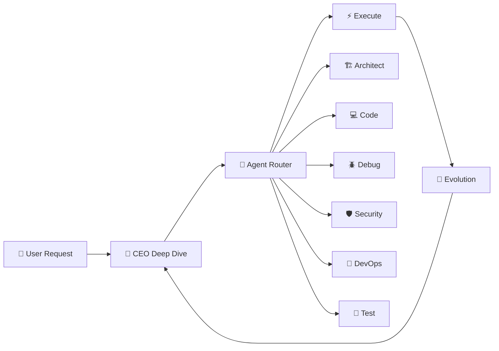

# 🤖 AME Agent System

> Multi-agent collaborative development system with 15 specialized AI modes, CEO Deep Dive pipeline, and automated code evolution.

[](LICENSE)
[](https://roocode.com)
[](https://platform.xiaomimimo.com)

---

## 🧠 What is AME Agent System?

AME (Autonomous Multi-agent Engine) is a **multi-agent collaborative development system** built on [Roo Code](https://roocode.com) that automates full-stack software development through specialized AI agents working together.

### Core Architecture



### 4-Stage Pipeline

| Stage | Description |
|-------|-------------|
| 🧠 **CEO Deep Dive** | Auto-reads memory files, scores task complexity (1-10), determines execution strategy |
| 🎯 **Agent Router** | 3-layer semantic routing: Intent → Context → Fallback selects optimal Agent mode |
| ⚡ **Execute** | Adaptive execution: Sequential (1-3) / Parallel (4-6) / Pipeline (7-10) with handoff protocol |
| 🔄 **Evolution** | Auto-logs lessons-learned, error-log, skill-suggestions for continuous improvement |

---

## 🎭 15 Specialized Agent Modes

| # | Mode | Purpose | Tool Access |
|---|------|---------|-------------|
| 1 | 🏗️ **Architect** | System design & planning | read, edit(.md), mcp |
| 2 | 💻 **Code** | Implementation & refactoring | read, edit, command, mcp |
| 3 | 🪲 **Debug** | Troubleshooting & diagnosis | read, edit, command, mcp |
| 4 | ❓ **Ask** | Research & explanations | read, mcp |
| 5 | 🪃 **Orchestrator** | Multi-agent coordination | read, mcp |
| 6 | 🚀 **DevOps** | Deployment & CI/CD | read, edit, command, mcp |
| 7 | ✍️ **Documentation** | Technical writing | read, edit, mcp |
| 8 | 🧪 **Test Engineer** | Test writing & coverage | read, edit, command, mcp |
| 9 | 🛡️ **Security** | Vulnerability auditing | read, mcp |
| 10 | 🧩 **Skill Writer** | Agent skill creation | read, edit, mcp |
| 11 | ✍️ **Mode Writer** | Custom mode creation | read, edit, mcp |
| 12 | 📝 **User Story** | Requirements & stories | read, edit, mcp |
| 13 | 🔀 **Merge Resolver** | Conflict resolution | read, edit, command, mcp |
| 14 | 🤖 **Google GenAI** | Gemini API integration | read, edit, command, mcp |
| 15 | 💡 **Coding Teacher** | Learning & guidance | read, mcp |

---

## 🛡️ 5-Layer Safety Guardrails

| Layer | Protection | Description |
|-------|-----------|-------------|
| 1 | **Input Validation** | CEO validates requests, detects malicious patterns |
| 2 | **Permission Boundaries** | Each mode has strict tool access & file restrictions |
| 3 | **Output Filtering** | CEO reviews results before presenting to user |
| 4 | **Rate Limiting** | Max 50K tokens/task, 5 agents, 3 handoffs |
| 5 | **Human Approval Gates** | Deploy, delete DB, force push require explicit approval |

---

## 📁 Project Structure

```
ame-agent-system/
├── .roomodes              # 15 custom AI agent modes (489 lines)
├── .roo/
│   ├── rules/             # Core principles & token optimization
│   └── rules-code/        # Code mode standards
├── .vscode/
│   ├── settings.json      # Editor, terminal, language configs
│   ├── extensions.json    # 28 recommended extensions
│   ├── launch.json        # Debug configurations
│   ├── tasks.json         # Build/test/deploy tasks
│   ├── keybindings.json   # Custom shortcuts
│   └── snippets/          # 5 snippet files (Python, React, JS, CSS)
├── .editorconfig          # Cross-platform coding style
├── club_project/          # Next.js 16 + Prisma + NextAuth
├── club-manager/          # React + Vite + Firebase
└── plans/                 # AME blueprints & implementation plans
```

---

## 🛠️ Tech Stack

### Projects Managed by AME

| Project | Stack | Description |
|---------|-------|-------------|
| **Startup Club** | Next.js 16 · React 19 · Prisma · NextAuth · Tailwind · shadcn/ui | Club management platform |
| **Club Manager** | React 19 · Vite 8 · Firebase · Zustand · i18next | Club management app |

### Development Tools

| Category | Tools |
|----------|-------|
| **Languages** | TypeScript, Python, JavaScript |
| **Frontend** | React, Next.js, Tailwind CSS, shadcn/ui |
| **Backend** | Prisma, Firebase, NextAuth |
| **State** | Zustand, TanStack Query |
| **Testing** | Vitest, Testing Library, pytest |
| **Linting** | ESLint, Ruff, Prettier |
| **AI Agent** | Roo Code (15 custom modes) |

---

## 📊 Complexity Scoring System

AME automatically scores tasks 1-10 and selects execution strategy:

| Score | Complexity | Execution | Agents |
|-------|-----------|-----------|--------|
| 1-3 | Simple | Sequential | 1 agent |
| 4-6 | Medium | Parallel (if independent) | 2-3 agents |
| 7-10 | Complex | Pipeline with handoff | Multi-agent |

---

## 🔄 Evolution Protocol

AME continuously improves through:

- **Task-level**: What worked → lessons-learned, What failed → error-log
- **Session-level**: Token usage tracking, agent performance metrics
- **System-level**: Error patterns → new rules, skill usage → improvements

### Performance Metrics Tracked

| Metric | Target |
|--------|--------|
| Token Efficiency | ≥ 30% |
| Success Rate | ≥ 95% |
| First-time Accuracy | ≥ 90% |
| Questions per Task | ≤ 0.5 |

---

## 🚀 Getting Started

### Prerequisites
- [VS Code](https://code.visualstudio.com/)
- [Roo Code Extension](https://marketplace.visualstudio.com/items?itemName=Rooveterinaryinc.roo-cline)
- Node.js >= 18

### Setup
1. Clone this repository
2. Open in VS Code
3. Install recommended extensions (auto-prompted)
4. Start using any of the 15 agent modes via Roo Code

---

## 📄 License

MIT License — see [LICENSE](LICENSE) for details.

---

> Built with ❤️ using Roo Code AI Agent Framework
> 
> 📧 **Author**: [s27424h647-ops](https://github.com/s27424h647-ops)
