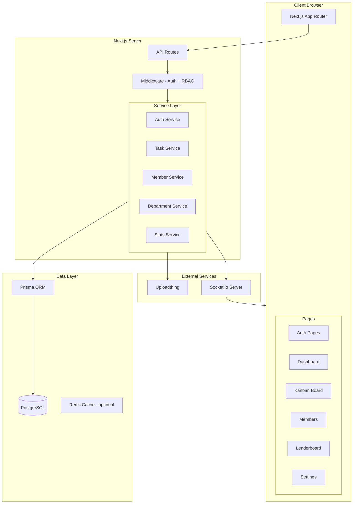
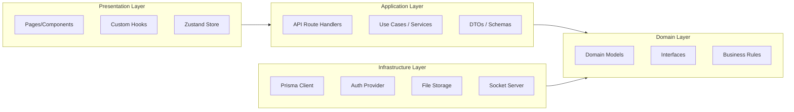
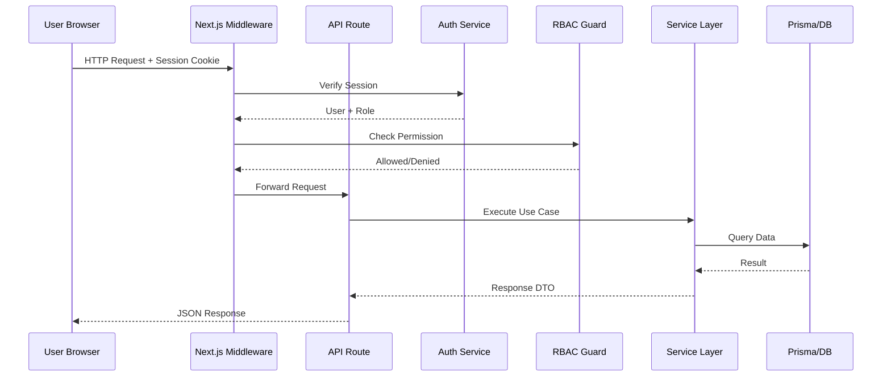

# 🏗️ Kiến Trúc Tổng Thể - Hệ Thống Quản Lý CLB Khởi Nghiệp Đổi Mới Sáng Tạo

## 📋 Mục Lục

1. [Tổng Quan Dự Án](#1-tổng-quan-dự-án)
2. [Lựa Chọn Công Nghệ](#2-lựa-chọn-công-nghệ)
3. [Kiến Trúc Hệ Thống](#3-kiến-trúc-hệ-thống)
4. [Cấu Trúc Thư Mục](#4-cấu-trúc-thư-mục)
5. [Kế Hoạch Triển Khai](#5-kế-hoạch-triển-khai)

---

## 1. Tổng Quan Dự Án

### Mục Tiêu
Xây dựng ứng dụng web quản lý Câu lạc bộ Khởi nghiệp Đổi mới Sáng tạo toàn diện, hỗ trợ:
- Hệ thống phân quyền 4 cấp (Admin, Chủ nhiệm, Trưởng ban, Thành viên)
- Quản lý nhiệm vụ Kanban Board với kéo-thả
- Quản lý thành viên theo ban chuyên môn
- Bảng xếp hạng thành tích
- Dashboard báo cáo trực quan
- Responsive, đa ngôn ngữ (VI/EN), Dark/Light Mode

### Quy Mô
- **Người dùng:** 50-500 thành viên
- **Đồng thời:** 50-100 users
- **Dữ liệu:** Tasks, Members, Departments, Comments, Attachments

---

## 2. Lựa Chọn Công Nghệ

### Tech Stack

| Layer | Công Nghệ | Lý Do Chọn | Phương Án Loại Bỏ |
|-------|-----------|------------|-------------------|
| **Framework** | Next.js 15 (App Router) | Full-stack SSR/CSR, API Routes, Server Components | ❌ Vite+React (thiếu SSR built-in), ❌ Remix (ít ecosystem hơn) |
| **Language** | TypeScript | Type-safe, IDE support tốt, giảm runtime errors | ❌ JavaScript (thiếu type safety) |
| **UI Library** | shadcn/ui + Tailwind CSS | Customizable, accessible, copy-paste components | ❌ MUI (nặng, khó customize), ❌ Ant Design (style không linh hoạt) |
| **Database** | PostgreSQL | ACID, JSON support, full-text search, mature | ❌ MongoDB (thiếu relational integrity), ❌ MySQL (thiếu JSON features) |
| **ORM** | Prisma | Type-safe queries, migration system, excellent DX | ❌ Drizzle (ít mature hơn), ❌ TypeORM (ít maintained) |
| **Auth** | NextAuth.js v5 | Built-in cho Next.js, credentials + OAuth, session management | ❌ Clerk (vendor lock-in), ❌ Auth0 (chi phí cao) |
| **Drag & Drop** | @hello-pangea/dnd | Fork maintained của react-beautiful-dnd, accessible, performant | ❌ dnd-kit (complex hơn cần thiết), ❌ react-dnd (ít intuitive) |
| **Charts** | Recharts | React-native, declarative, responsive | ❌ Chart.js (canvas-based, khó customize), ❌ D3 (overkill) |
| **State** | Zustand + React Query | Lightweight, no boilerplate, server state caching | ❌ Redux (quá nặng), ❌ Jotai (thiếu devtools) |
| **i18n** | next-intl | Built-in cho Next.js App Router, server/client support | ❌ react-i18next (thiếu server support) |
| **Realtime** | Socket.io | Comment realtime, notifications | ❌ Pusher (vendor lock-in), ❌ SSE (thiếu bidirectional) |
| **File Upload** | Uploadthing | Simple integration với Next.js, S3-backed | ❌ Cloudinary (đắt hơn), ❌ tự build (phức tạp) |
| **Validation** | Zod | Type inference, schema validation, form integration | ❌ Yup (ít type-safe), ❌ Joi (Node-only) |
| **Testing** | Vitest + Playwright | Fast, E2E coverage | ❌ Jest (chậm hơn), ❌ Cypress (ít native) |

### Quyết Định Kiến Trúc

| Quyết Định | Lựa Chọn | Lý Do | Rủi Ro |
|------------|----------|-------|--------|
| Rendering | Hybrid SSR + CSR | Dashboard SSR cho SEO/performance, Kanban CSR cho interactivity | Complexity trong code splitting |
| Database | Single PostgreSQL | Đủ cho quy mô 500 users, đơn giản hóa deployment | Cần migration nếu scale > 10K users |
| Auth Strategy | Credentials + Session | Phù hợp CLB (không cần OAuth phức tạp) | Cần hash password đúng cách |
| Realtime | Socket.io cho comments | Cập nhật tức thì cho collaboration | Tăng server load |
| File Storage | Uploadthing (S3) | Tách biệt file storage khỏi app server | Chi phí storage tăng theo thời gian |

---

## 3. Kiến Trúc Hệ Thống

### 3.1 High-Level Architecture



### 3.2 Clean Architecture Layers



### 3.3 Request Flow



---

## 4. Cấu Trúc Thư Mục

```
startup-club-project/
├── 📄 package.json
├── 📄 tsconfig.json
├── 📄 next.config.ts
├── 📄 tailwind.config.ts
├── 📄 .env.local
├── 📄 .env.example
│
├── 📂 prisma/
│   ├── 📄 schema.prisma          # Database schema
│   ├── 📄 seed.ts                 # Seed data
│   └── 📂 migrations/            # Auto-generated migrations
│
├── 📂 public/
│   ├── 📂 images/
│   ├── 📂 icons/
│   └── 📂 locales/               # i18n translation files
│       ├── 📄 vi.json
│       └── 📄 en.json
│
├── 📂 src/
│   ├── 📂 app/                    # Next.js App Router
│   │   ├── 📄 layout.tsx          # Root layout
│   │   ├── 📄 page.tsx            # Landing page
│   │   ├── 📄 globals.css
│   │   │
│   │   ├── 📂 [locale]/           # i18n routing
│   │   │   ├── 📄 layout.tsx      # Locale layout
│   │   │   │
│   │   │   ├── 📂 (auth)/         # Auth group
│   │   │   │   ├── 📂 login/
│   │   │   │   └── 📂 register/
│   │   │   │
│   │   │   └── 📂 (dashboard)/    # Dashboard group (protected)
│   │   │       ├── 📄 layout.tsx  # Dashboard layout with sidebar
│   │   │       ├── 📄 page.tsx    # Dashboard home
│   │   │       │
│   │   │       ├── 📂 tasks/      # Kanban Board
│   │   │       │   ├── 📄 page.tsx
│   │   │       │   └── 📂 [taskId]/
│   │   │       │
│   │   │       ├── 📂 members/    # Member management
│   │   │       │   ├── 📄 page.tsx
│   │   │       │   └── 📂 [memberId]/
│   │   │       │
│   │   │       ├── 📂 departments/ # Department management
│   │   │       │   ├── 📄 page.tsx
│   │   │       │   └── 📂 [deptId]/
│   │   │       │
│   │   │       ├── 📂 leaderboard/ # Leaderboard
│   │   │       │
│   │   │       ├── 📂 reports/     # Reports & Analytics
│   │   │       │
│   │   │       └── 📂 settings/    # User settings
│   │   │
│   │   └── 📂 api/                # API Routes
│   │       ├── 📂 auth/
│   │       │   └── 📂 [...nextauth]/
│   │       ├── 📂 tasks/
│   │       ├── 📂 members/
│   │       ├── 📂 departments/
│   │       ├── 📂 comments/
│   │       ├── 📂 attachments/
│   │       ├── 📂 stats/
│   │       └── 📂 upload/
│   │
│   ├── 📂 components/             # Shared components
│   │   ├── 📂 ui/                 # shadcn/ui components
│   │   ├── 📂 layout/             # Layout components
│   │   │   ├── 📄 Sidebar.tsx
│   │   │   ├── 📄 Header.tsx
│   │   │   ├── 📄 MobileNav.tsx
│   │   │   └── 📄 ThemeToggle.tsx
│   │   ├── 📂 kanban/             # Kanban components
│   │   │   ├── 📄 KanbanBoard.tsx
│   │   │   ├── 📄 KanbanColumn.tsx
│   │   │   ├── 📄 KanbanCard.tsx
│   │   │   └── 📄 TaskDetail.tsx
│   │   ├── 📂 dashboard/          # Dashboard widgets
│   │   │   ├── 📄 StatsCard.tsx
│   │   │   ├── 📄 ProgressChart.tsx
│   │   │   ├── 📄 RecentActivity.tsx
│   │   │   └── 📄 TaskOverview.tsx
│   │   ├── 📂 members/            # Member components
│   │   ├── 📂 leaderboard/        # Leaderboard components
│   │   └── 📂 shared/             # Shared components
│   │       ├── 📄 DataTable.tsx
│   │       ├── 📄 SearchFilter.tsx
│   │       ├── 📄 FileUpload.tsx
│   │       └── 📄 CommentSection.tsx
│   │
│   ├── 📂 lib/                    # Utility libraries
│   │   ├── 📄 prisma.ts           # Prisma client singleton
│   │   ├── 📄 auth.ts             # NextAuth configuration
│   │   ├── 📄 socket.ts           # Socket.io setup
│   │   ├── 📄 utils.ts            # General utilities
│   │   └── 📄 constants.ts        # App constants
│   │
│   ├── 📂 server/                 # Server-side logic
│   │   ├── 📂 services/           # Business logic
│   │   │   ├── 📄 auth.service.ts
│   │   │   ├── 📄 task.service.ts
│   │   │   ├── 📄 member.service.ts
│   │   │   ├── 📄 department.service.ts
│   │   │   ├── 📄 comment.service.ts
│   │   │   └── 📄 stats.service.ts
│   │   │
│   │   ├── 📂 guards/             # Authorization guards
│   │   │   ├── 📄 rbac.ts         # Role-based access control
│   │   │   └── 📄 permissions.ts  # Permission definitions
│   │   │
│   │   └── 📂 queries/            # Database queries
│   │       ├── 📄 task.queries.ts
│   │       ├── 📄 member.queries.ts
│   │       └── 📄 stats.queries.ts
│   │
│   ├── 📂 hooks/                  # Custom React hooks
│   │   ├── 📄 useAuth.ts
│   │   ├── 📄 useTasks.ts
│   │   ├── 📄 useMembers.ts
│   │   ├── 📄 useSocket.ts
│   │   └── 📄 useMediaQuery.ts
│   │
│   ├── 📂 stores/                 # Zustand stores
│   │   ├── 📄 authStore.ts
│   │   ├── 📄 taskStore.ts
│   │   └── 📄 uiStore.ts          # Theme, sidebar, locale
│   │
│   ├── 📂 types/                  # TypeScript types
│   │   ├── 📄 index.ts
│   │   ├── 📄 auth.ts
│   │   ├── 📄 task.ts
│   │   ├── 📄 member.ts
│   │   └── 📄 department.ts
│   │
│   └── 📂 schemas/                # Zod validation schemas
│       ├── 📄 auth.schema.ts
│       ├── 📄 task.schema.ts
│       └── 📄 member.schema.ts
│
└── 📂 tests/
    ├── 📂 unit/
    ├── 📂 integration/
    └── 📂 e2e/
```

---

## 5. Kế Hoạch Triển Khai

### Phase 1: Foundation (Tuần 1-2)
- [ ] Setup Next.js + TypeScript + Tailwind + shadcn/ui
- [ ] Setup Prisma + PostgreSQL schema
- [ ] Implement Auth (NextAuth.js v5 + Credentials)
- [ ] RBAC middleware + permission guards
- [ ] Basic layout (Sidebar, Header, Theme, i18n)

### Phase 2: Core Features (Tuần 3-4)
- [ ] Kanban Board (drag & drop, CRUD tasks)
- [ ] Task detail (comments, attachments, assignees)
- [ ] Member management (CRUD, department assignment)
- [ ] Department management

### Phase 3: Advanced Features (Tuần 5-6)
- [ ] Dashboard với charts (Recharts)
- [ ] Leaderboard + scoring algorithm
- [ ] Realtime comments (Socket.io)
- [ ] File upload (Uploadthing)

### Phase 4: Polish (Tuần 7-8)
- [ ] Responsive design refinement
- [ ] i18n completion (VI/EN)
- [ ] Dark/Light mode polish
- [ ] Performance optimization
- [ ] Testing (unit + E2E)
- [ ] Documentation

---

## 📊 Rủi Ro & Mitigation

| Rủi Ro | Mức Độ | Mitigation |
|--------|--------|------------|
| Socket.io scaling | 🟡 Medium | Có thể migrate sang Pusher/SSE nếu cần |
| Prisma N+1 queries | 🟡 Medium | Sử dụng `include` và `select` đúng cách |
| Auth security | 🔴 High | bcrypt hashing, CSRF protection, rate limiting |
| File storage costs | 🟢 Low | Giới hạn file size, cleanup old files |
| i18n complexity | 🟢 Low | Sử dụng next-intl, lazy load translations |

---

## 🏆 Kết Luận

Kiến trúc sử dụng **Next.js 15 + TypeScript + PostgreSQL + Prisma** là lựa chọn tối ưu cho dự án này vì:

1. **Full-stack trong 1 framework** - Giảm complexity deployment
2. **Type-safe end-to-end** - Từ DB schema đến UI components
3. **Scalable** - Có thể tách API server nếu cần scale
4. **Developer Experience** - Hot reload, type inference, excellent tooling
5. **Community** - Ecosystem lớn, nhiều resources

> **Bước tiếp theo:** Xem chi tiết Database Schema tại [`01-database-schema.md`](plans/01-database-schema.md) và RBAC Design tại [`02-rbac-design.md`](plans/02-rbac-design.md).
