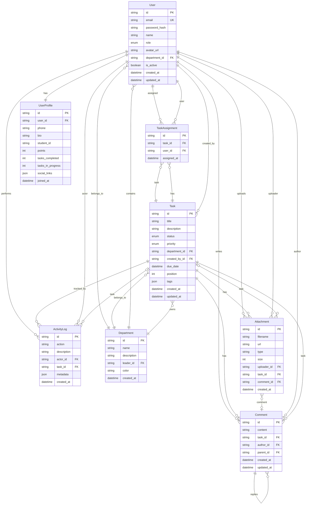

# 🗄️ Database Schema Design - CLB Khởi Nghiệp Đổi Mới Sáng Tạo

## 📋 Mục Lục

1. [Entity Relationship Diagram](#1-entity-relationship-diagram)
2. [Chi Tiết Các Bảng](#2-chi-tiết-các-bảng)
3. [Prisma Schema](#3-prisma-schema)
4. [Seed Data Strategy](#4-seed-data-strategy)
5. [Index Strategy](#5-index-strategy)

---

## 1. Entity Relationship Diagram



---

## 2. Chi Tiết Các Bảng

### 2.1 User (Người dùng)

| Field | Type | Constraints | Mô Tả |
|-------|------|-------------|--------|
| `id` | UUID | PK, auto-generated | Định danh duy nhất |
| `email` | VARCHAR(255) | UNIQUE, NOT NULL | Email đăng nhập |
| `password_hash` | VARCHAR(255) | NOT NULL | Mật khẩu đã hash (bcrypt) |
| `name` | VARCHAR(100) | NOT NULL | Họ tên hiển thị |
| `role` | ENUM | NOT NULL, default MEMBER | Vai trò: ADMIN, CHAIRMAN, DEPARTMENT_LEADER, MEMBER |
| `avatar_url` | VARCHAR(500) | NULLABLE | URL ảnh đại diện |
| `department_id` | UUID | FK -> Department, NULLABLE | Ban chuyên môn |
| `is_active` | BOOLEAN | default true | Trạng thái hoạt động |
| `created_at` | TIMESTAMP | auto | Thời điểm tạo |
| `updated_at` | TIMESTAMP | auto | Thời điểm cập nhật |

**Indexes:** email (unique), department_id, role

### 2.2 UserProfile (Hồ sơ cá nhân)

| Field | Type | Constraints | Mô Tả |
|-------|------|-------------|--------|
| `id` | UUID | PK | Định danh |
| `user_id` | UUID | FK -> User, UNIQUE | Liên kết user |
| `phone` | VARCHAR(20) | NULLABLE | Số điện thoại |
| `bio` | TEXT | NULLABLE | Giới thiệu bản thân |
| `student_id` | VARCHAR(20) | NULLABLE | Mã số sinh viên |
| `points` | INT | default 0 | Điểm thành tích |
| `tasks_completed` | INT | default 0 | Số nhiệm vụ hoàn thành |
| `tasks_in_progress` | INT | default 0 | Số nhiệm vụ đang làm |
| `social_links` | JSON | NULLABLE | Links mạng xã hội |
| `joined_at` | TIMESTAMP | auto | Ngày tham gia CLB |

**Indexes:** user_id (unique), points (desc cho leaderboard)

### 2.3 Department (Ban chuyên môn)

| Field | Type | Constraints | Mô Tả |
|-------|------|-------------|--------|
| `id` | UUID | PK | Định danh |
| `name` | VARCHAR(100) | NOT NULL, UNIQUE | Tên ban |
| `description` | TEXT | NULLABLE | Mô tả ban |
| `leader_id` | UUID | FK -> User, NULLABLE | Trưởng ban |
| `color` | VARCHAR(7) | default '#6366f1' | Màu đại diện (hex) |
| `created_at` | TIMESTAMP | auto | Thời điểm tạo |

**Indexes:** leader_id, name (unique)

### 2.4 Task (Nhiệm vụ)

| Field | Type | Constraints | Mô Tả |
|-------|------|-------------|--------|
| `id` | UUID | PK | Định danh |
| `title` | VARCHAR(255) | NOT NULL | Tiêu đề nhiệm vụ |
| `description` | TEXT | NULLABLE | Mô tả chi tiết |
| `status` | ENUM | NOT NULL, default TODO | TODO, IN_PROGRESS, IN_REVIEW, DONE |
| `priority` | ENUM | NOT NULL, default MEDIUM | LOW, MEDIUM, HIGH, URGENT |
| `department_id` | UUID | FK -> Department, NULLABLE | Ban phụ trách |
| `created_by_id` | UUID | FK -> User, NOT NULL | Người tạo |
| `due_date` | TIMESTAMP | NULLABLE | Hạn chót |
| `position` | INT | NOT NULL, default 0 | Thứ tự trong cột Kanban |
| `tags` | JSON | NULLABLE | Tags phân loại |
| `created_at` | TIMESTAMP | auto | Thời điểm tạo |
| `updated_at` | TIMESTAMP | auto | Thời điểm cập nhật |

**Indexes:** status, department_id, created_by_id, due_date, position

### 2.5 TaskAssignment (Phân công nhiệm vụ)

| Field | Type | Constraints | Mô Tả |
|-------|------|-------------|--------|
| `id` | UUID | PK | Định danh |
| `task_id` | UUID | FK -> Task, NOT NULL | Nhiệm vụ |
| `user_id` | UUID | FK -> User, NOT NULL | Người được giao |
| `assigned_at` | TIMESTAMP | auto | Thời điểm giao |

**Constraints:** UNIQUE(task_id, user_id) - không giao trùng
**Indexes:** task_id, user_id

### 2.6 Comment (Bình luận)

| Field | Type | Constraints | Mô Tả |
|-------|------|-------------|--------|
| `id` | UUID | PK | Định danh |
| `content` | TEXT | NOT NULL | Nội dung bình luận |
| `task_id` | UUID | FK -> Task, NOT NULL | Nhiệm vụ liên quan |
| `author_id` | UUID | FK -> User, NOT NULL | Tác giả |
| `parent_id` | UUID | FK -> Comment, NULLABLE | Comment cha (reply) |
| `created_at` | TIMESTAMP | auto | Thời điểm tạo |
| `updated_at` | TIMESTAMP | auto | Thời điểm sửa |

**Indexes:** task_id, author_id, parent_id

### 2.7 Attachment (Tệp đính kèm)

| Field | Type | Constraints | Mô Tả |
|-------|------|-------------|--------|
| `id` | UUID | PK | Định danh |
| `filename` | VARCHAR(255) | NOT NULL | Tên file gốc |
| `url` | VARCHAR(500) | NOT NULL | URL lưu trữ |
| `type` | VARCHAR(50) | NOT NULL | MIME type |
| `size` | INT | NOT NULL | Kích thước bytes |
| `uploader_id` | UUID | FK -> User, NOT NULL | Người upload |
| `task_id` | UUID | FK -> Task, NULLABLE | Task liên quan |
| `comment_id` | UUID | FK -> Comment, NULLABLE | Comment liên quan |
| `created_at` | TIMESTAMP | auto | Thời điểm upload |

**Indexes:** task_id, comment_id, uploader_id

### 2.8 ActivityLog (Nhật ký hoạt động)

| Field | Type | Constraints | Mô Tả |
|-------|------|-------------|--------|
| `id` | UUID | PK | Định danh |
| `action` | VARCHAR(50) | NOT NULL | Loại hành động |
| `description` | VARCHAR(500) | NOT NULL | Mô tả hành động |
| `actor_id` | UUID | FK -> User, NOT NULL | Người thực hiện |
| `task_id` | UUID | FK -> Task, NULLABLE | Task liên quan |
| `metadata` | JSON | NULLABLE | Dữ liệu bổ sung |
| `created_at` | TIMESTAMP | auto | Thời điểm |

**Action types:** TASK_CREATED, TASK_UPDATED, TASK_MOVED, TASK_COMPLETED, COMMENT_ADDED, MEMBER_JOINED, MEMBER_LEFT, DEPARTMENT_CREATED

**Indexes:** actor_id, task_id, action, created_at (desc)

---

## 3. Prisma Schema

```prisma
// prisma/schema.prisma

generator client {
  provider = "prisma-client-js"
}

datasource db {
  provider = "postgresql"
  url      = env("DATABASE_URL")
}

// ==================== Enums ====================

enum Role {
  ADMIN
  CHAIRMAN
  DEPARTMENT_LEADER
  MEMBER
}

enum TaskStatus {
  TODO
  IN_PROGRESS
  IN_REVIEW
  DONE
}

enum Priority {
  LOW
  MEDIUM
  HIGH
  URGENT
}

enum ActivityAction {
  TASK_CREATED
  TASK_UPDATED
  TASK_MOVED
  TASK_COMPLETED
  TASK_ASSIGNED
  COMMENT_ADDED
  MEMBER_JOINED
  MEMBER_LEFT
  DEPARTMENT_CREATED
  DEPARTMENT_UPDATED
}

// ==================== Models ====================

model User {
  id             String    @id @default(uuid())
  email          String    @unique
  passwordHash   String    @map("password_hash")
  name           String
  role           Role      @default(MEMBER)
  avatarUrl      String?   @map("avatar_url")
  departmentId   String?   @map("department_id")
  isActive       Boolean   @default(true) @map("is_active")
  createdAt      DateTime  @default(now()) @map("created_at")
  updatedAt      DateTime  @updatedAt @map("updated_at")

  // Relations
  department     Department? @relation(fields: [departmentId], references: [id])
  profile        UserProfile?
  createdTasks   Task[]      @relation("TaskCreator")
  assignments    TaskAssignment[]
  comments       Comment[]
  attachments    Attachment[]
  activityLogs   ActivityLog[]
  ledDepartment  Department?   @relation("DepartmentLeader")

  @@index([departmentId])
  @@index([role])
  @@map("users")
}

model UserProfile {
  id              String   @id @default(uuid())
  userId          String   @unique @map("user_id")
  phone           String?
  bio             String?
  studentId       String?  @map("student_id")
  points          Int      @default(0)
  tasksCompleted  Int      @default(0) @map("tasks_completed")
  tasksInProgress Int      @default(0) @map("tasks_in_progress")
  socialLinks     Json?    @map("social_links")
  joinedAt        DateTime @default(now()) @map("joined_at")

  // Relations
  user User @relation(fields: [userId], references: [id], onDelete: Cascade)

  @@index([points(sort: Desc)])
  @@map("user_profiles")
}

model Department {
  id          String   @id @default(uuid())
  name        String   @unique
  description String?
  leaderId    String?  @map("leader_id")
  color       String   @default("#6366f1")
  createdAt   DateTime @default(now()) @map("created_at")

  // Relations
  leader   User?  @relation("DepartmentLeader", fields: [leaderId], references: [id])
  members  User[]
  tasks    Task[]

  @@index([leaderId])
  @@map("departments")
}

model Task {
  id            String     @id @default(uuid())
  title         String
  description   String?
  status        TaskStatus @default(TODO)
  priority      Priority   @default(MEDIUM)
  departmentId  String?    @map("department_id")
  createdById   String     @map("created_by_id")
  dueDate       DateTime?  @map("due_date")
  position      Int        @default(0)
  tags          Json?
  createdAt     DateTime   @default(now()) @map("created_at")
  updatedAt     DateTime   @updatedAt @map("updated_at")

  // Relations
  department   Department?      @relation(fields: [departmentId], references: [id])
  createdBy    User             @relation("TaskCreator", fields: [createdById], references: [id])
  assignments  TaskAssignment[]
  comments     Comment[]
  attachments  Attachment[]
  activityLogs ActivityLog[]

  @@index([status])
  @@index([departmentId])
  @@index([createdById])
  @@index([dueDate])
  @@index([position])
  @@map("tasks")
}

model TaskAssignment {
  id         String   @id @default(uuid())
  taskId     String   @map("task_id")
  userId     String   @map("user_id")
  assignedAt DateTime @default(now()) @map("assigned_at")

  // Relations
  task Task @relation(fields: [taskId], references: [id], onDelete: Cascade)
  user User @relation(fields: [userId], references: [id], onDelete: Cascade)

  @@unique([taskId, userId])
  @@index([taskId])
  @@index([userId])
  @@map("task_assignments")
}

model Comment {
  id        String    @id @default(uuid())
  content   String
  taskId    String    @map("task_id")
  authorId  String    @map("author_id")
  parentId  String?   @map("parent_id")
  createdAt DateTime  @default(now()) @map("created_at")
  updatedAt DateTime  @updatedAt @map("updated_at")

  // Relations
  task        Task        @relation(fields: [taskId], references: [id], onDelete: Cascade)
  author      User        @relation(fields: [authorId], references: [id])
  parent      Comment?    @relation("CommentReplies", fields: [parentId], references: [id])
  replies     Comment[]   @relation("CommentReplies")
  attachments Attachment[]

  @@index([taskId])
  @@index([authorId])
  @@index([parentId])
  @@map("comments")
}

model Attachment {
  id         String   @id @default(uuid())
  filename   String
  url        String
  type       String
  size       Int
  uploaderId String   @map("uploader_id")
  taskId     String?  @map("task_id")
  commentId  String?  @map("comment_id")
  createdAt  DateTime @default(now()) @map("created_at")

  // Relations
  uploader User     @relation(fields: [uploaderId], references: [id])
  task     Task?    @relation(fields: [taskId], references: [id], onDelete: Cascade)
  comment  Comment? @relation(fields: [commentId], references: [id], onDelete: Cascade)

  @@index([taskId])
  @@index([commentId])
  @@index([uploaderId])
  @@map("attachments")
}

model ActivityLog {
  id          String         @id @default(uuid())
  action      ActivityAction
  description String
  actorId     String         @map("actor_id")
  taskId      String?        @map("task_id")
  metadata    Json?
  createdAt   DateTime       @default(now()) @map("created_at")

  // Relations
  actor User  @relation(fields: [actorId], references: [id])
  task  Task? @relation(fields: [taskId], references: [id], onDelete: SetNull)

  @@index([actorId])
  @@index([taskId])
  @@index([action])
  @@index([createdAt(sort: Desc)])
  @@map("activity_logs")
}
```

---

## 4. Seed Data Strategy

### Initial Data

```typescript
// prisma/seed.ts - Cấu trúc seed data

const seedData = {
  // 1. Tạo Admin account
  admin: {
    email: "admin@startup-club.vn",
    name: "Quản trị viên",
    role: "ADMIN",
  },

  // 2. Tạo các ban chuyên môn mặc định
  departments: [
    { name: "Ban Công nghệ", color: "#3b82f6", description: "Phát triển sản phẩm công nghệ" },
    { name: "Ban Kinh doanh", color: "#10b981", description: "Kinh doanh và tiếp thị" },
    { name: "Ban Truyền thông", color: "#f59e0b", description: "Truyền thông và marketing" },
    { name: "Ban Nhân sự", color: "#ef4444", description: "Quản lý nhân sự và tuyển dụng" },
    { name: "Ban Sự kiện", color: "#8b5cf6", description: "Tổ chức sự kiện và hoạt động" },
  ],

  // 3. Tạo sample tasks cho demo
  sampleTasks: [
    {
      title: "Tổ chức Workshop Khởi nghiệp 2025",
      status: "IN_PROGRESS",
      priority: "HIGH",
      department: "Ban Sự kiện",
    },
    {
      title: "Thiết kế Logo CLB mới",
      status: "TODO",
      priority: "MEDIUM",
      department: "Ban Truyền thông",
    },
    {
      title: "Phát triển Website CLB",
      status: "IN_PROGRESS",
      priority: "HIGH",
      department: "Ban Công nghệ",
    },
  ],
};
```

---

## 5. Index Strategy

### Composite Indexes cho Performance

```prisma
// Thêm vào schema.prisma nếu cần

// Kanban board query optimization
model Task {
  @@index([departmentId, status, position])
  @@index([status, position])
}

// Leaderboard query optimization
model UserProfile {
  @@index([points(sort: Desc), tasksCompleted(sort: Desc)])
}

// Activity feed optimization
model ActivityLog {
  @@index([createdAt(sort: Desc), action])
}
```

### Query Patterns & Expected Performance

| Query Pattern | Index Used | Expected Time |
|--------------|------------|---------------|
| Get tasks by department + status | `departmentId, status, position` | < 5ms |
| Get leaderboard (top N) | `points DESC, tasksCompleted DESC` | < 10ms |
| Get recent activity feed | `createdAt DESC, action` | < 5ms |
| Get user's assigned tasks | `userId` on TaskAssignment | < 5ms |
| Search tasks by title | Full-text index (PostgreSQL) | < 20ms |

---

## 📊 Quyết Định Thiết Kế

| Quyết Định | Lựa Chọn | Lý Do | Phương Án Loại Bỏ |
|------------|----------|-------|-------------------|
| ID Strategy | UUID | Distributed-friendly, không expose sequential IDs | ❌ Auto-increment (predictable) |
| Soft Delete | Không dùng | Đơn giản hóa, dùng `isActive` flag thay vì deletedAt | ❌ Soft delete (phức tạp queries) |
| Profile tách bảng | Tách UserProfile | Tránh load profile data khi chỉ cần auth info | ❌ Gộp vào User (over-fetch) |
| Activity Log | Separate table | Audit trail, analytics, không ảnh hưởng main queries | ❌ JSON field (không query được) |
| Tags | JSON field | Flexible, không cần bảng riêng cho quy mô nhỏ | ❌ Separate Tag table (overkill) |
| Position tracking | Integer field | Đơn giản cho Kanban reorder | ❌ Float/double (precision issues) |

> **Bước tiếp tiếp theo:** Xem chi tiết RBAC Design tại [`02-rbac-design.md`](plans/02-rbac-design.md).
