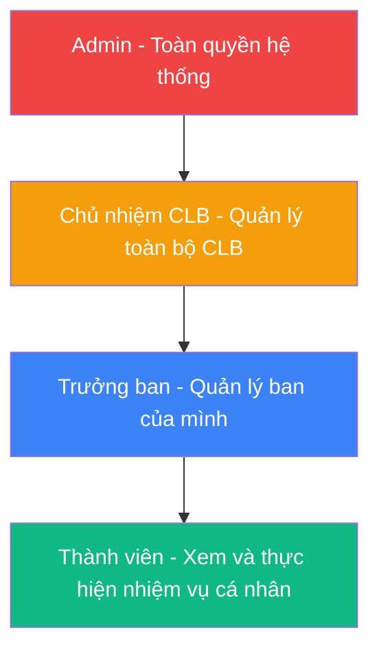
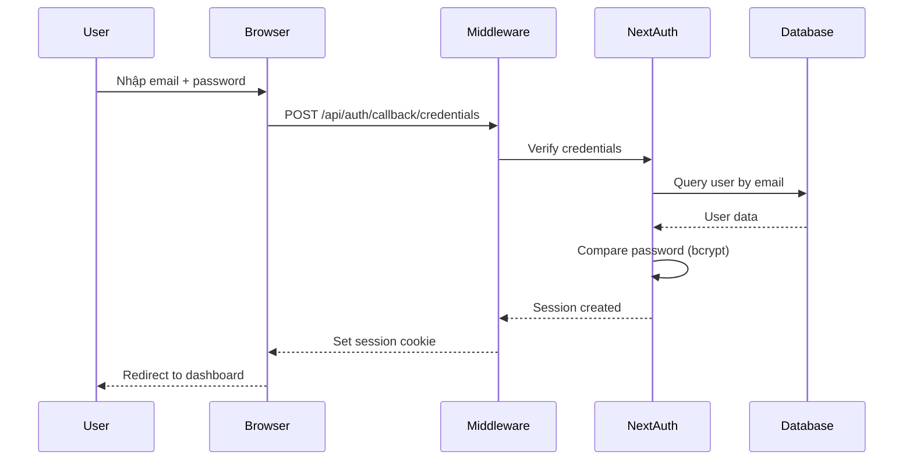
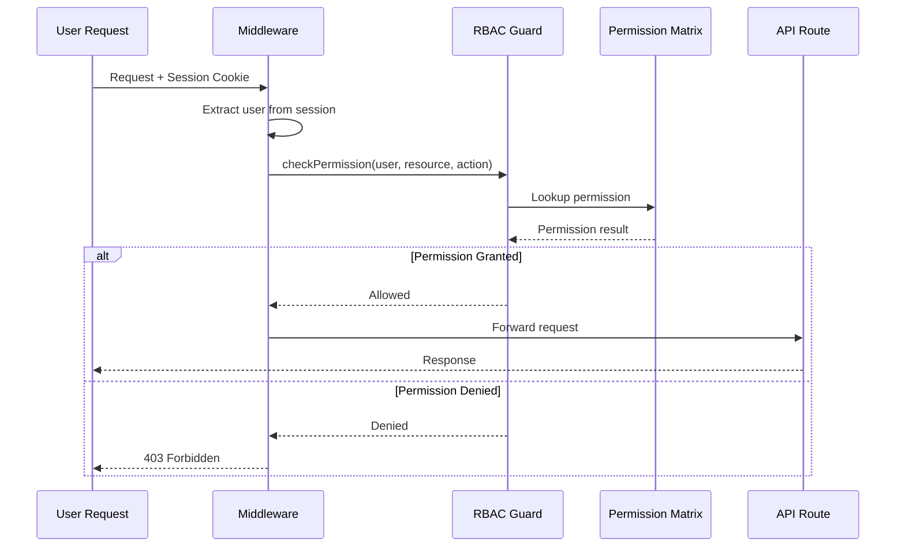
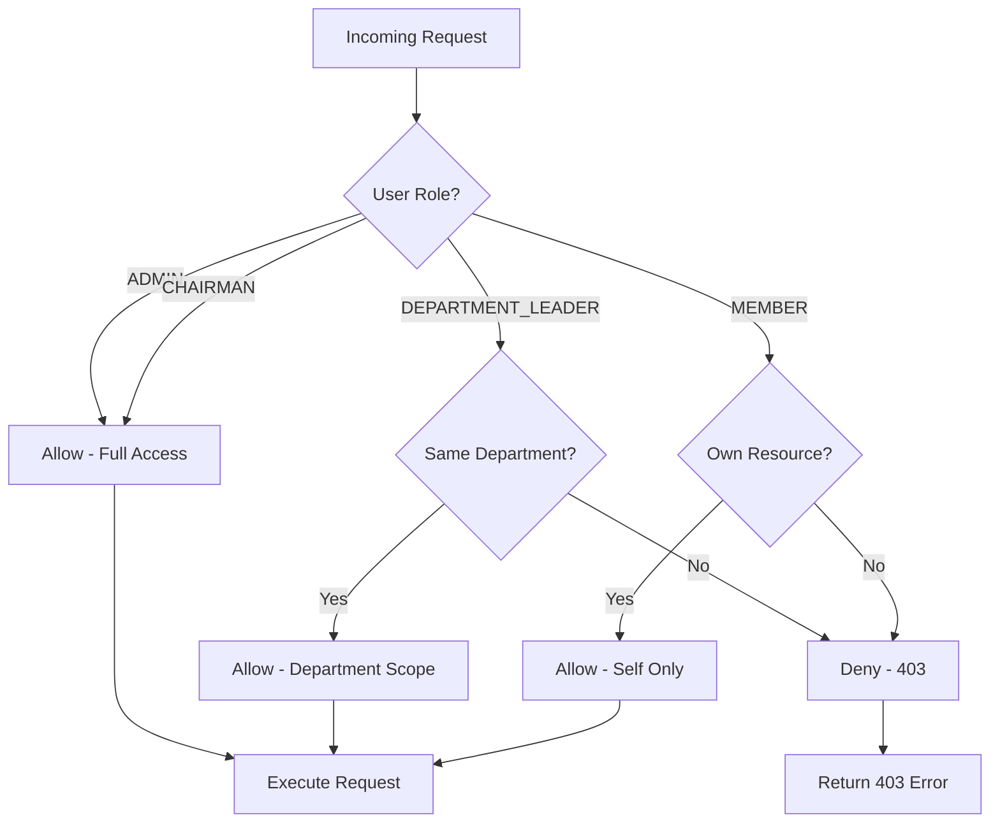
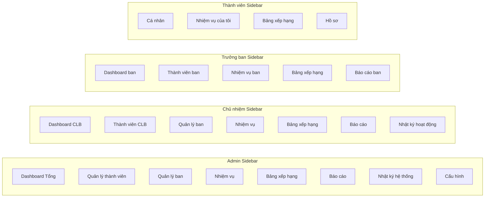
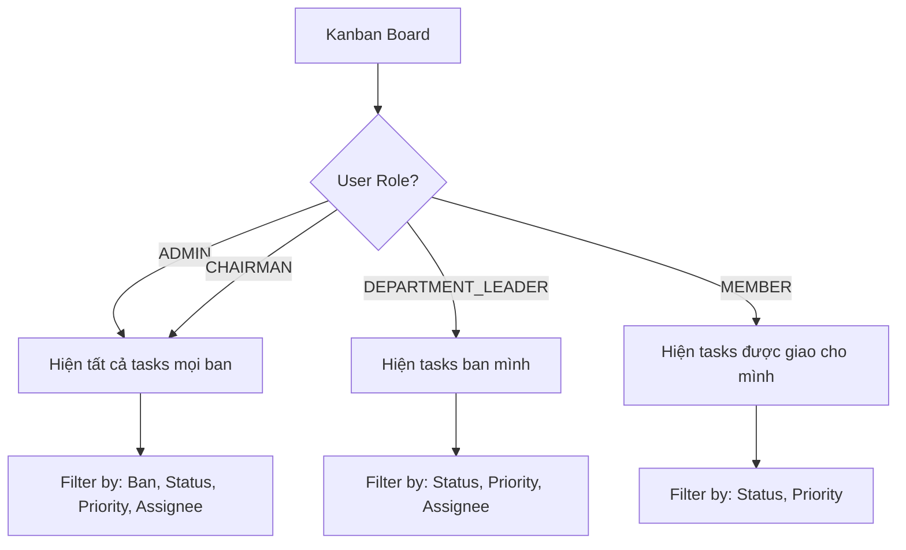

# 🛡️ RBAC Design - Hệ Thống Phân Quyền 4 Cấp

## 📋 Mục Lục

1. [Tổng Quan Phân Quyền](#1-tổng-quan-phân-quyền)
2. [Ma Trận Quyền Chi Tiết](#2-ma-trận-quyền-chi-tiết)
3. [Luồng Xác Thực & Ủy Quyền](#3-luồng-xác-thự--ủy-quyền)
4. [Implementation Strategy](#4-implementation-strategy)
5. [Giao Diện Theo Vai Trò](#5-giao-diện-theo-vai-trò)

---

## 1. Tổng Quan Phân Quyền

### 1.1 Hierarchical Role Model



### 1.2 Vai Trò & Phạm Vi

| Vai Trò | Mã | Phạm Vi | Số Lượng | Mô Tả |
|---------|-----|---------|----------|--------|
| **Admin** | `ADMIN` | Toàn hệ thống | 1-2 | Quản trị hệ thống, cấu hình, tạo/xóa tài khoản |
| **Chủ nhiệm CLB** | `CHAIRMAN` | Toàn CLB | 1-2 | Quản lý thành viên, ban, nhiệm vụ, báo cáo toàn CLB |
| **Trưởng ban** | `DEPARTMENT_LEADER` | Ban của mình | 5-8 | Quản lý thành viên ban, nhiệm vụ ban, báo cáo ban |
| **Thành viên** | `MEMBER` | Cá nhân | 40-200 | Xem nhiệm vụ được giao, cập nhật trạng thái, bình luận |

---

## 2. Ma Trận Quyền Chi Tiết

### 2.1 Permission Matrix - Tasks (Nhiệm vụ)

| Hành Động | Admin | Chủ nhiệm | Trưởng ban | Thành viên |
|-----------|:-----:|:---------:|:----------:|:----------:|
| Xem tất cả nhiệm vụ CLB | ✅ | ✅ | ❌ | ❌ |
| Xem nhiệm vụ ban mình | ✅ | ✅ | ✅ | ✅ |
| Tạo nhiệm vụ (bất kỳ ban) | ✅ | ✅ | ❌ | ❌ |
| Tạo nhiệm vụ (ban mình) | ✅ | ✅ | ✅ | ❌ |
| Chỉnh sửa nhiệm vụ (bất kỳ) | ✅ | ✅ | ❌ | ❌ |
| Chỉnh sửa nhiệm vụ (ban mình) | ✅ | ✅ | ✅ | ❌ |
| Xóa nhiệm vụ | ✅ | ✅ | ❌ | ❌ |
| Di chuyển trạng thái (nhiệm vụ mình) | ✅ | ✅ | ✅ | ✅ |
| Gán người phụ trách | ✅ | ✅ | ✅ (ban mình) | ❌ |
| Đặt hạn chót | ✅ | ✅ | ✅ (ban mình) | ❌ |
| Đính kèm tệp | ✅ | ✅ | ✅ | ✅ |
| Bình luận | ✅ | ✅ | ✅ | ✅ |

### 2.2 Permission Matrix - Members (Thành viên)

| Hành Động | Admin | Chủ nhiệm | Trưởng ban | Thành viên |
|-----------|:-----:|:---------:|:----------:|:----------:|
| Xem tất cả thành viên CLB | ✅ | ✅ | ❌ | ❌ |
| Xem thành viên ban mình | ✅ | ✅ | ✅ | ✅ |
| Xem hồ sơ cá nhân | ✅ | ✅ | ✅ | ✅ (chỉ mình) |
| Chỉnh sửa hồ sơ cá nhân | ✅ | ✅ | ✅ | ✅ (chỉ mình) |
| Tạo tài khoản thành viên | ✅ | ✅ | ❌ | ❌ |
| Chỉnh sửa thông tin thành viên | ✅ | ✅ | ❌ | ❌ |
| Vô hiệu hóa tài khoản | ✅ | ✅ | ❌ | ❌ |
| Phân công vào ban | ✅ | ✅ | ❌ | ❌ |
| Bổ nhiệm trưởng ban | ✅ | ✅ | ❌ | ❌ |
| Thay đổi vai trò | ✅ | ❌ | ❌ | ❌ |

### 2.3 Permission Matrix - Departments (Ban chuyên môn)

| Hành Động | Admin | Chủ nhiệm | Trưởng ban | Thành viên |
|-----------|:-----:|:---------:|:----------:|:----------:|
| Xem tất cả ban | ✅ | ✅ | ✅ | ✅ |
| Tạo ban mới | ✅ | ✅ | ❌ | ❌ |
| Chỉnh sửa thông tin ban | ✅ | ✅ | ❌ | ❌ |
| Xóa ban | ✅ | ❌ | ❌ | ❌ |
| Quản lý thành viên ban mình | ✅ | ✅ | ✅ | ❌ |

### 2.4 Permission Matrix - Reports & Dashboard

| Hành Động | Admin | Chủ nhiệm | Trưởng ban | Thành viên |
|-----------|:-----:|:---------:|:----------:|:----------:|
| Dashboard toàn CLB | ✅ | ✅ | ❌ | ❌ |
| Dashboard ban mình | ✅ | ✅ | ✅ | ❌ |
| Dashboard cá nhân | ✅ | ✅ | ✅ | ✅ |
| Bảng xếp hạng toàn CLB | ✅ | ✅ | ✅ | ✅ |
| Bảng xếp hạng ban mình | ✅ | ✅ | ✅ | ✅ |
| Xuất báo cáo | ✅ | ✅ | ❌ | ❌ |
| Nhật ký hoạt động toàn CLB | ✅ | ✅ | ❌ | ❌ |
| Nhật ký hoạt động ban mình | ✅ | ✅ | ✅ | ❌ |

### 2.5 Permission Matrix - System (Hệ thống)

| Hành Động | Admin | Chủ nhiệm | Trưởng ban | Thành viên |
|-----------|:-----:|:---------:|:----------:|:----------:|
| Cấu hình hệ thống | ✅ | ❌ | ❌ | ❌ |
| Quản lý Admin khác | ✅ | ❌ | ❌ | ❌ |
| Backup dữ liệu | ✅ | ❌ | ❌ | ❌ |
| Xem audit log | ✅ | ❌ | ❌ | ❌ |
| Quản lý i18n | ✅ | ❌ | ❌ | ❌ |

---

## 3. Luồng Xác Thực & Ủy Quyền

### 3.1 Authentication Flow



### 3.2 Authorization Flow (RBAC Guard)



### 3.3 Department-Scoped Access



---

## 4. Implementation Strategy

### 4.1 Permission Definition

```typescript
// src/server/guards/permissions.ts

export const PERMISSIONS = {
  // Task permissions
  TASK_VIEW_ALL: ["ADMIN", "CHAIRMAN"],
  TASK_VIEW_DEPARTMENT: ["ADMIN", "CHAIRMAN", "DEPARTMENT_LEADER"],
  TASK_CREATE_GLOBAL: ["ADMIN", "CHAIRMAN"],
  TASK_CREATE_DEPARTMENT: ["ADMIN", "CHAIRMAN", "DEPARTMENT_LEADER"],
  TASK_EDIT_GLOBAL: ["ADMIN", "CHAIRMAN"],
  TASK_EDIT_DEPARTMENT: ["ADMIN", "CHAIRMAN", "DEPARTMENT_LEADER"],
  TASK_DELETE: ["ADMIN", "CHAIRMAN"],
  TASK_MOVE_STATUS: ["ADMIN", "CHAIRMAN", "DEPARTMENT_LEADER", "MEMBER"],
  TASK_ASSIGN: ["ADMIN", "CHAIRMAN", "DEPARTMENT_LEADER"],
  TASK_COMMENT: ["ADMIN", "CHAIRMAN", "DEPARTMENT_LEADER", "MEMBER"],
  TASK_ATTACH: ["ADMIN", "CHAIRMAN", "DEPARTMENT_LEADER", "MEMBER"],

  // Member permissions
  MEMBER_VIEW_ALL: ["ADMIN", "CHAIRMAN"],
  MEMBER_VIEW_DEPARTMENT: ["ADMIN", "CHAIRMAN", "DEPARTMENT_LEADER"],
  MEMBER_CREATE: ["ADMIN", "CHAIRMAN"],
  MEMBER_EDIT_GLOBAL: ["ADMIN", "CHAIRMAN"],
  MEMBER_EDIT_SELF: ["ADMIN", "CHAIRMAN", "DEPARTMENT_LEADER", "MEMBER"],
  MEMBER_DEACTIVATE: ["ADMIN", "CHAIRMAN"],
  MEMBER_ASSIGN_DEPARTMENT: ["ADMIN", "CHAIRMAN"],
  MEMBER_APPOINT_LEADER: ["ADMIN", "CHAIRMAN"],

  // Department permissions
  DEPT_VIEW: ["ADMIN", "CHAIRMAN", "DEPARTMENT_LEADER", "MEMBER"],
  DEPT_CREATE: ["ADMIN", "CHAIRMAN"],
  DEPT_EDIT: ["ADMIN", "CHAIRMAN"],
  DEPT_DELETE: ["ADMIN"],
  DEPT_MANAGE_MEMBERS: ["ADMIN", "CHAIRMAN", "DEPARTMENT_LEADER"],

  // Report permissions
  REPORT_CLUB_DASHBOARD: ["ADMIN", "CHAIRMAN"],
  REPORT_DEPARTMENT_DASHBOARD: ["ADMIN", "CHAIRMAN", "DEPARTMENT_LEADER"],
  REPORT_PERSONAL_DASHBOARD: ["ADMIN", "CHAIRMAN", "DEPARTMENT_LEADER", "MEMBER"],
  REPORT_LEADERBOARD: ["ADMIN", "CHAIRMAN", "DEPARTMENT_LEADER", "MEMBER"],
  REPORT_EXPORT: ["ADMIN", "CHAIRMAN"],
  REPORT_ACTIVITY_LOG_ALL: ["ADMIN", "CHAIRMAN"],
  REPORT_ACTIVITY_LOG_DEPARTMENT: ["ADMIN", "CHAIRMAN", "DEPARTMENT_LEADER"],

  // System permissions
  SYSTEM_CONFIG: ["ADMIN"],
  SYSTEM_MANAGE_ADMINS: ["ADMIN"],
  SYSTEM_BACKUP: ["ADMIN"],
  SYSTEM_AUDIT_LOG: ["ADMIN"],
} as const;

export type Permission = keyof typeof PERMISSIONS;
export type Role = "ADMIN" | "CHAIRMAN" | "DEPARTMENT_LEADER" | "MEMBER";
```

### 4.2 RBAC Guard

```typescript
// src/server/guards/rbac.ts

import { PERMISSIONS, type Permission, type Role } from "./permissions";

export interface RBACContext {
  user: {
    id: string;
    role: Role;
    departmentId: string | null;
  };
  resource?: {
    departmentId?: string;
    ownerId?: string;
  };
}

export function hasPermission(
  role: Role,
  permission: Permission
): boolean {
  return PERMISSIONS[permission].includes(role);
}

export function checkDepartmentAccess(
  context: RBACContext,
  targetDepartmentId: string
): boolean {
  const { role, departmentId } = context.user;

  // Admin and Chairman have access to all departments
  if (role === "ADMIN" || role === "CHAIRMAN") return true;

  // Department leaders and members only access their own department
  return departmentId === targetDepartmentId;
}

export function checkResourceAccess(
  context: RBACContext,
  resource: { departmentId?: string; ownerId?: string }
): boolean {
  const { role, id, departmentId } = context.user;

  // Admin and Chairman have full access
  if (role === "ADMIN" || role === "CHAIRMAN") return true;

  // Check department scope
  if (resource.departmentId && departmentId !== resource.departmentId) {
    return false;
  }

  // For self-only resources, check ownership
  if (resource.ownerId && role === "MEMBER") {
    return id === resource.ownerId;
  }

  return true;
}
```

### 4.3 Middleware Integration

```typescript
// src/middleware.ts (Next.js Middleware)

import { auth } from "@/lib/auth";
import { NextResponse } from "next/server";

const publicPaths = ["/login", "/register", "/api/auth"];
const roleBasedPaths: Record<string, string[]> = {
  "/admin": ["ADMIN"],
  "/members/manage": ["ADMIN", "CHAIRMAN"],
  "/departments/manage": ["ADMIN", "CHAIRMAN"],
  "/reports/club": ["ADMIN", "CHAIRMAN"],
  "/reports/department": ["ADMIN", "CHAIRMAN", "DEPARTMENT_LEADER"],
};

export default auth((req) => {
  const { pathname } = req.nextUrl;
  const session = req.auth;

  // Allow public paths
  if (publicPaths.some((p) => pathname.startsWith(p))) {
    return NextResponse.next();
  }

  // Redirect to login if not authenticated
  if (!session) {
    return NextResponse.redirect(new URL("/login", req.url));
  }

  // Check role-based access
  const userRole = session.user.role;
  for (const [path, allowedRoles] of Object.entries(roleBasedPaths)) {
    if (pathname.startsWith(path) && !allowedRoles.includes(userRole)) {
      return NextResponse.redirect(new URL("/dashboard", req.url));
    }
  }

  return NextResponse.next();
});

export const config = {
  matcher: ["/((?!_next/static|_next/image|favicon.ico).*)"],
};
```

### 4.4 API Route Guard

```typescript
// src/server/guards/api-guard.ts

import { NextRequest, NextResponse } from "next/server";
import { auth } from "@/lib/auth";
import { hasPermission, checkDepartmentAccess } from "./rbac";
import type { Permission } from "./permissions";

export function withPermission(permission: Permission) {
  return async (req: NextRequest, handler: Function) => {
    const session = await auth();

    if (!session) {
      return NextResponse.json({ error: "Unauthorized" }, { status: 401 });
    }

    if (!hasPermission(session.user.role, permission)) {
      return NextResponse.json({ error: "Forbidden" }, { status: 403 });
    }

    return handler(req, session);
  };
}

export function withDepartmentScope(permission: Permission) {
  return async (
    req: NextRequest,
    departmentId: string,
    handler: Function
  ) => {
    const session = await auth();

    if (!session) {
      return NextResponse.json({ error: "Unauthorized" }, { status: 401 });
    }

    if (!hasPermission(session.user.role, permission)) {
      return NextResponse.json({ error: "Forbidden" }, { status: 403 });
    }

    if (
      !checkDepartmentAccess(
        { user: session.user },
        departmentId
      )
    ) {
      return NextResponse.json({ error: "Forbidden" }, { status: 403 });
    }

    return handler(req, session);
  };
}
```

---

## 5. Giao Diện Theo Vai Trò

### 5.1 Sidebar Navigation theo Role



### 5.2 Dashboard Content theo Role

| Component | Admin | Chủ nhiệm | Trưởng ban | Thành viên |
|-----------|:-----:|:---------:|:----------:|:----------:|
| Thống kê toàn CLB | ✅ | ✅ | ❌ | ❌ |
| Thống kê ban | ✅ | ✅ | ✅ | ❌ |
| Thống kê cá nhân | ✅ | ✅ | ✅ | ✅ |
| Biểu đồ tiến độ CLB | ✅ | ✅ | ❌ | ❌ |
| Biểu đồ tiến độ ban | ✅ | ✅ | ✅ | ❌ |
| Hoạt động gần đây (toàn CLB) | ✅ | ✅ | ❌ | ❌ |
| Hoạt động gần đây (ban) | ✅ | ✅ | ✅ | ❌ |
| Nhiệm vụ sắp đến hạn | ✅ | ✅ | ✅ | ✅ |
| Thành viên mới | ✅ | ✅ | ✅ (ban) | ❌ |
| Quick actions | ✅ | ✅ | ✅ | Limited |

### 5.3 Kanban Board Visibility



---

## 📊 Quyết Định Thiết Kế

| Quyết Định | Lựa Chọn | Lý Do | Phương Án Loại Bỏ |
|------------|----------|-------|-------------------|
| RBAC Model | Role-based (không phải Attribute-based) | Đơn giản, đủ cho 4 cấp vai trò | ❌ ABAC (overkill cho quy mô này) |
| Permission Check | Server-side (Middleware + API Guard) | Bảo mật, không thể bypass từ client | ❌ Client-only (không an toàn) |
| Department Scoping | Logic trong service layer | Flexible, dễ test | ❌ Database-level row security (phức tạp) |
| Session Strategy | JWT + Database Session | Stateless auth + ability to revoke | ❌ Pure JWT (không revoke được) |
| Role Hierarchy | Flat (không kế thừa) | Mỗi role có permission riêng, rõ ràng | ❌ Hierarchical (khó debug) |

---

## 🔒 Security Considerations

1. **Password Hashing:** bcrypt với salt rounds >= 12
2. **CSRF Protection:** NextAuth built-in CSRF tokens
3. **Rate Limiting:** Giới hạn login attempts (5/15min)
4. **Session Timeout:** 24h idle timeout, 7d absolute timeout
5. **Audit Logging:** Ghi lại mọi thay đổi permission/role
6. **Input Validation:** Zod schemas cho mọi API input
7. **SQL Injection:** Prisma parameterized queries (built-in)
8. **XSS Prevention:** React auto-escaping + CSP headers

> **Bước tiếp theo:** Xem chi tiết API Design tại [`03-api-design.md`](plans/03-api-design.md).
