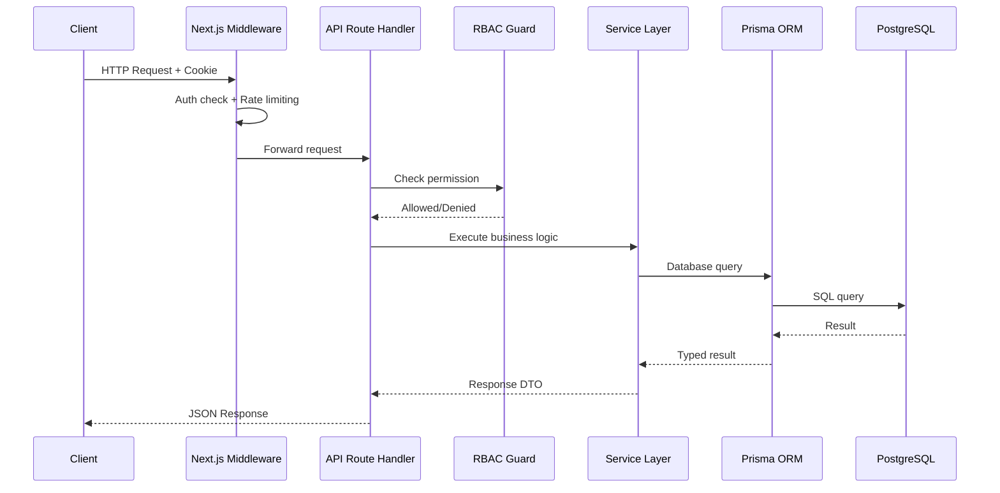
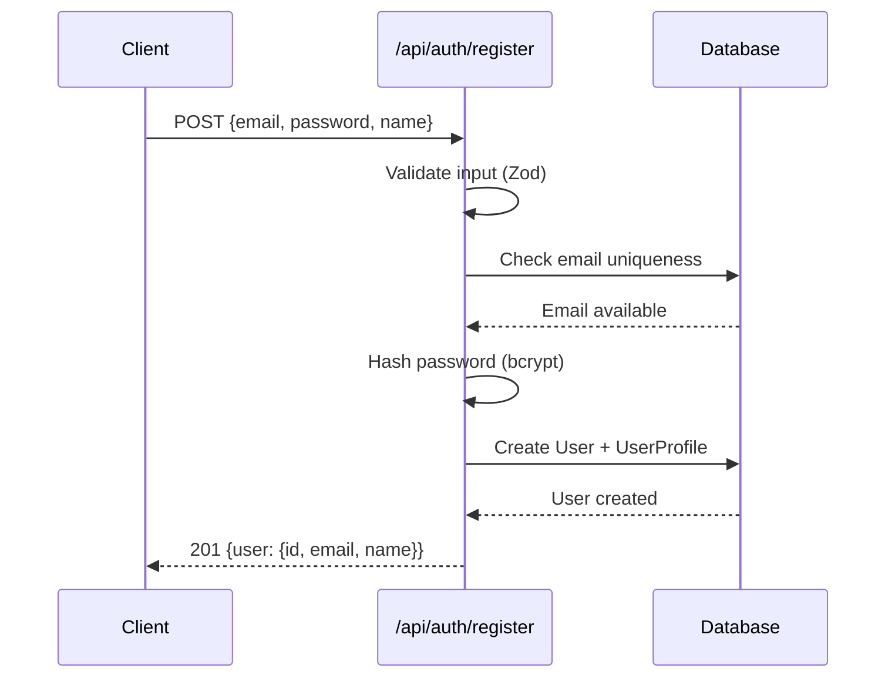
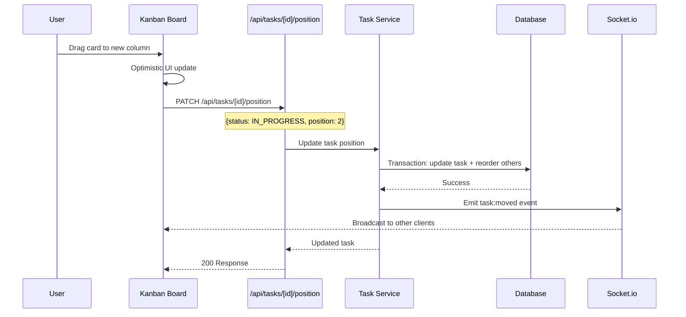
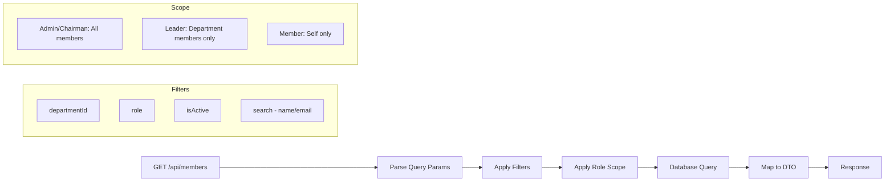
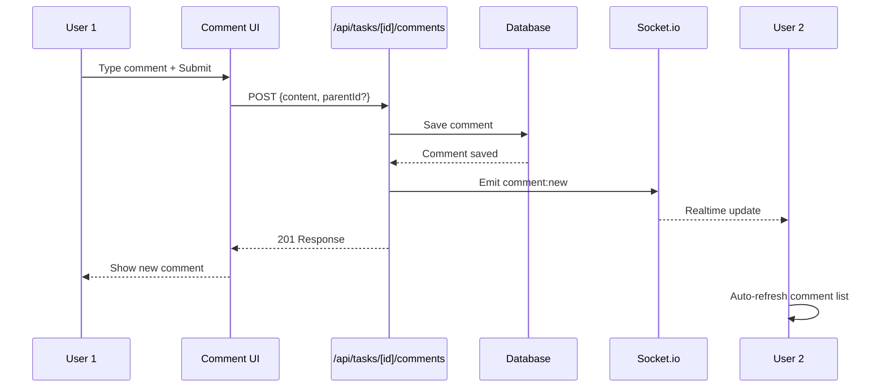
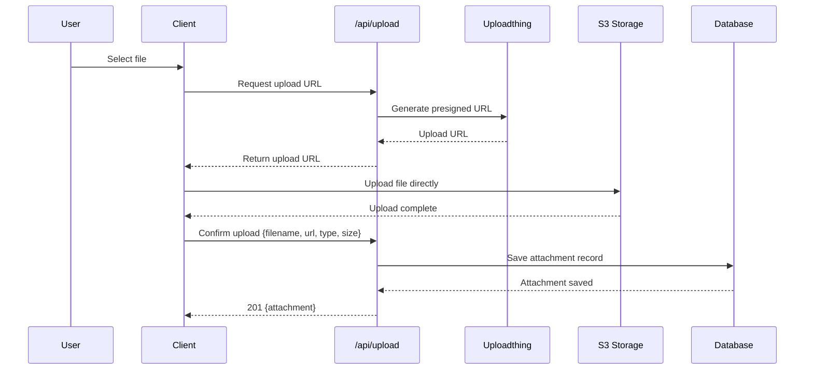
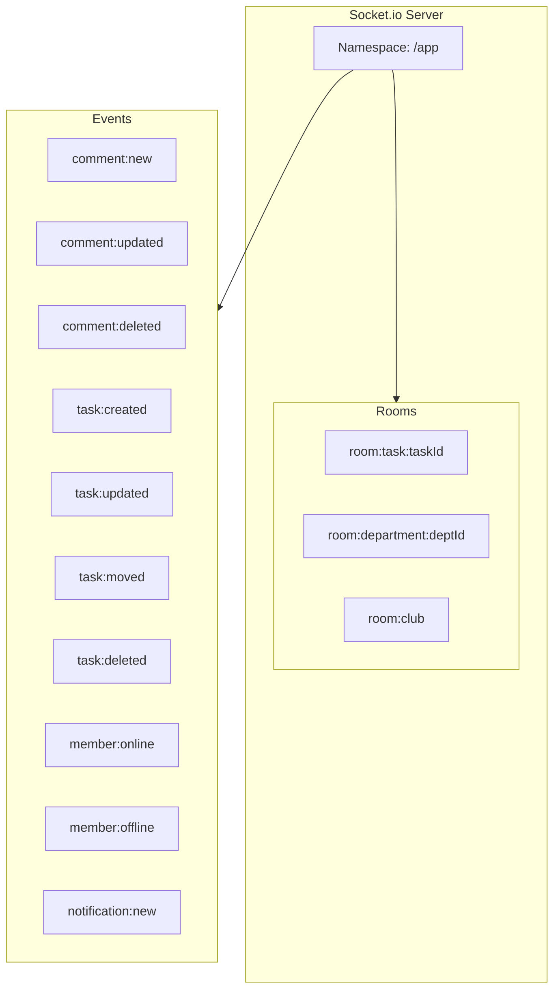
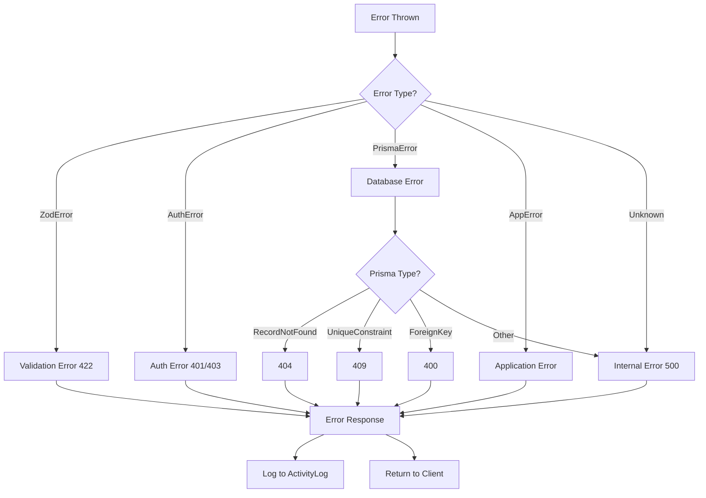

# 🔌 API Design & Data Flow - CLB Khởi Nghiệp

## 📋 Mục Lục

1. [API Architecture](#1-api-architecture)
2. [Auth APIs](#2-auth-apis)
3. [Task APIs](#3-task-apis)
4. [Member APIs](#4-member-apis)
5. [Department APIs](#5-department-apis)
6. [Comment APIs](#6-comment-apis)
7. [Stats & Reports APIs](#7-stats--reports-apis)
8. [Upload APIs](#8-upload-apis)
9. [Socket.io Events](#9-socketio-events)
10. [Error Handling](#10-error-handling)

---

## 1. API Architecture

### 1.1 Base URL & Versioning

```
Base URL: /api/v1
Content-Type: application/json
Authentication: Bearer Token (Session Cookie via NextAuth)
```

### 1.2 API Flow Diagram



### 1.3 Standard Response Format

```typescript
// Success Response
interface ApiResponse<T> {
  success: true;
  data: T;
  meta?: {
    page: number;
    limit: number;
    total: number;
    totalPages: number;
  };
}

// Error Response
interface ApiError {
  success: false;
  error: {
    code: string;
    message: string;
    details?: Record<string, string[]>;
  };
}
```

### 1.4 Pagination & Filtering

```typescript
// Query parameters cho list endpoints
interface ListQuery {
  page?: number;        // default: 1
  limit?: number;       // default: 20, max: 100
  sort?: string;        // e.g., "createdAt:desc"
  search?: string;      // Full-text search
  filter?: string;      // JSON filter string
}
```

---

## 2. Auth APIs

### 2.1 Endpoints

| Method | Endpoint | Mô Tả | Auth |
|--------|----------|--------|:----:|
| POST | `/api/auth/register` | Đăng ký tài khoản mới | ❌ |
| POST | `/api/auth/callback/credentials` | Đăng nhập (NextAuth) | ❌ |
| POST | `/api/auth/signout` | Đăng xuất | ✅ |
| GET | `/api/auth/session` | Lấy session hiện tại | ✅ |
| PUT | `/api/auth/change-password` | Đổi mật khẩu | ✅ |

### 2.2 Register Flow



### 2.3 Request/Response Examples

**POST /api/auth/register**
```json
// Request
{
  "email": "user@club.vn",
  "password": "SecurePass123!",
  "name": "Nguyễn Văn A"
}

// Response 201
{
  "success": true,
  "data": {
    "id": "uuid-123",
    "email": "user@club.vn",
    "name": "Nguyễn Văn A",
    "role": "MEMBER"
  }
}
```

**PUT /api/auth/change-password**
```json
// Request
{
  "currentPassword": "OldPass123!",
  "newPassword": "NewPass456!"
}

// Response 200
{
  "success": true,
  "data": { "message": "Password changed successfully" }
}
```

---

## 3. Task APIs

### 3.1 Endpoints

| Method | Endpoint | Mô Tả | Permission |
|--------|----------|--------|------------|
| GET | `/api/tasks` | Danh sách nhiệm vụ | TASK_VIEW_* |
| POST | `/api/tasks` | Tạo nhiệm vụ mới | TASK_CREATE_* |
| GET | `/api/tasks/[id]` | Chi tiết nhiệm vụ | TASK_VIEW_* |
| PUT | `/api/tasks/[id]` | Cập nhật nhiệm vụ | TASK_EDIT_* |
| DELETE | `/api/tasks/[id]` | Xóa nhiệm vụ | TASK_DELETE |
| PATCH | `/api/tasks/[id]/status` | Đổi trạng thái | TASK_MOVE_STATUS |
| PATCH | `/api/tasks/[id]/position` | Di chuyển Kanban | TASK_MOVE_STATUS |
| POST | `/api/tasks/[id]/assign` | Gán người phụ trách | TASK_ASSIGN |
| DELETE | `/api/tasks/[id]/assign/[userId]` | Bỏ gán | TASK_ASSIGN |

### 3.2 Task Data Flow - Kanban Drag & Drop



### 3.3 Request/Response Examples

**GET /api/tasks?status=TODO&departmentId=xxx&page=1&limit=20**
```json
// Response 200
{
  "success": true,
  "data": [
    {
      "id": "task-1",
      "title": "Tổ chức Workshop",
      "description": "Workshop về khởi nghiệp...",
      "status": "TODO",
      "priority": "HIGH",
      "department": {
        "id": "dept-1",
        "name": "Ban Sự kiện",
        "color": "#8b5cf6"
      },
      "createdBy": {
        "id": "user-1",
        "name": "Nguyễn Văn A",
        "avatarUrl": "..."
      },
      "assignees": [
        {
          "id": "user-2",
          "name": "Trần Thị B",
          "avatarUrl": "..."
        }
      ],
      "dueDate": "2025-06-15T00:00:00Z",
      "tags": ["workshop", "event"],
      "commentCount": 5,
      "attachmentCount": 2,
      "position": 0,
      "createdAt": "2025-05-01T10:00:00Z",
      "updatedAt": "2025-05-07T15:30:00Z"
    }
  ],
  "meta": {
    "page": 1,
    "limit": 20,
    "total": 45,
    "totalPages": 3
  }
}
```

**POST /api/tasks**
```json
// Request
{
  "title": "Thiết kế Banner sự kiện",
  "description": "Thiết kế banner cho sự kiện 20/11",
  "priority": "HIGH",
  "departmentId": "dept-3",
  "assigneeIds": ["user-2", "user-5"],
  "dueDate": "2025-11-01T00:00:00Z",
  "tags": ["design", "event"]
}

// Response 201
{
  "success": true,
  "data": {
    "id": "task-new",
    "title": "Thiết kế Banner sự kiện",
    "status": "TODO",
    "priority": "HIGH",
    "position": 3,
    "createdAt": "2025-05-07T17:00:00Z"
  }
}
```

**PATCH /api/tasks/[id]/position**
```json
// Request
{
  "status": "IN_PROGRESS",
  "position": 1
}

// Response 200
{
  "success": true,
  "data": {
    "id": "task-1",
    "status": "IN_PROGRESS",
    "position": 1,
    "updatedAt": "2025-05-07T17:05:00Z"
  }
}
```

---

## 4. Member APIs

### 4.1 Endpoints

| Method | Endpoint | Mô Tả | Permission |
|--------|----------|--------|------------|
| GET | `/api/members` | Danh sách thành viên | MEMBER_VIEW_* |
| POST | `/api/members` | Tạo thành viên mới | MEMBER_CREATE |
| GET | `/api/members/[id]` | Chi tiết thành viên | MEMBER_VIEW_* |
| PUT | `/api/members/[id]` | Cập nhật thông tin | MEMBER_EDIT_* |
| PATCH | `/api/members/[id]/role` | Thay đổi vai trò | MEMBER_APPOINT_LEADER |
| PATCH | `/api/members/[id]/department` | Chuyển ban | MEMBER_ASSIGN_DEPARTMENT |
| PATCH | `/api/members/[id]/deactivate` | Vô hiệu hóa | MEMBER_DEACTIVATE |
| GET | `/api/members/[id]/tasks` | Nhiệm vụ của thành viên | MEMBER_VIEW_* |
| GET | `/api/members/[id]/stats` | Thống kê cá nhân | MEMBER_VIEW_* |

### 4.2 Member List with Filtering



### 4.3 Request/Response Examples

**GET /api/members?departmentId=dept-1&role=MEMBER&search=nguyen**
```json
// Response 200
{
  "success": true,
  "data": [
    {
      "id": "user-2",
      "email": "nguyen@club.vn",
      "name": "Nguyễn Văn A",
      "role": "MEMBER",
      "avatarUrl": "...",
      "department": {
        "id": "dept-1",
        "name": "Ban Công nghệ"
      },
      "profile": {
        "points": 150,
        "tasksCompleted": 12,
        "tasksInProgress": 3
      },
      "isActive": true,
      "createdAt": "2025-01-15T00:00:00Z"
    }
  ],
  "meta": { "page": 1, "limit": 20, "total": 8, "totalPages": 1 }
}
```

---

## 5. Department APIs

### 5.1 Endpoints

| Method | Endpoint | Mô Tả | Permission |
|--------|----------|--------|------------|
| GET | `/api/departments` | Danh sách ban | DEPT_VIEW |
| POST | `/api/departments` | Tạo ban mới | DEPT_CREATE |
| GET | `/api/departments/[id]` | Chi tiết ban | DEPT_VIEW |
| PUT | `/api/departments/[id]` | Cập nhật ban | DEPT_EDIT |
| DELETE | `/api/departments/[id]` | Xóa ban | DEPT_DELETE |
| GET | `/api/departments/[id]/members` | Thành viên ban | DEPT_VIEW |
| GET | `/api/departments/[id]/tasks` | Nhiệm vụ ban | DEPT_VIEW |
| GET | `/api/departments/[id]/stats` | Thống kê ban | REPORT_* |

### 5.2 Request/Response Examples

**GET /api/departments**
```json
// Response 200
{
  "success": true,
  "data": [
    {
      "id": "dept-1",
      "name": "Ban Công nghệ",
      "description": "Phát triển sản phẩm công nghệ",
      "color": "#3b82f6",
      "leader": {
        "id": "user-3",
        "name": "Lê Văn C",
        "avatarUrl": "..."
      },
      "memberCount": 15,
      "activeTaskCount": 8,
      "createdAt": "2025-01-01T00:00:00Z"
    }
  ]
}
```

---

## 6. Comment APIs

### 6.1 Endpoints

| Method | Endpoint | Mô Tả | Permission |
|--------|----------|--------|------------|
| GET | `/api/tasks/[id]/comments` | Danh sách bình luận | TASK_VIEW_* |
| POST | `/api/tasks/[id]/comments` | Thêm bình luận | TASK_COMMENT |
| PUT | `/api/comments/[id]` | Sửa bình luận | Tác giả hoặc Admin |
| DELETE | `/api/comments/[id]` | Xóa bình luận | Tác giả hoặc Admin |

### 6.2 Comment with Realtime Flow



### 6.3 Request/Response Examples

**POST /api/tasks/[id]/comments**
```json
// Request
{
  "content": "Tôi đã hoàn thành phần thiết kế, mọi người review giúp!",
  "parentId": null
}

// Response 201
{
  "success": true,
  "data": {
    "id": "comment-new",
    "content": "Tôi đã hoàn thành phần thiết kế...",
    "author": {
      "id": "user-2",
      "name": "Trần Thị B",
      "avatarUrl": "..."
    },
    "parentId": null,
    "replies": [],
    "createdAt": "2025-05-07T17:10:00Z"
  }
}
```

---

## 7. Stats & Reports APIs

### 7.1 Endpoints

| Method | Endpoint | Mô Tả | Permission |
|--------|----------|--------|------------|
| GET | `/api/stats/club` | Thống kê toàn CLB | REPORT_CLUB_DASHBOARD |
| GET | `/api/stats/departments/[id]` | Thống kê ban | REPORT_DEPARTMENT_DASHBOARD |
| GET | `/api/stats/members/[id]` | Thống kê cá nhân | REPORT_PERSONAL_DASHBOARD |
| GET | `/api/stats/leaderboard` | Bảng xếp hạng | REPORT_LEADERBOARD |
| GET | `/api/stats/leaderboard?departmentId=x` | BXH theo ban | REPORT_LEADERBOARD |
| GET | `/api/activity` | Nhật ký hoạt động | REPORT_ACTIVITY_LOG_* |

### 7.2 Stats Data Flow

```mermaid
flowchart TD
    subgraph Dashboard[Dashboard Page]
        CLUB_STATS[CLB Stats Cards]
        DEPT_CHART[Department Chart]
        TASK_CHART[Task Progress Chart]
        ACTIVITY_FEED[Activity Feed]
        LEADERBOARD[Top Members]
    end

    subgraph APIs[API Endpoints]
        S1[/api/stats/club]
        S2[/api/stats/departments/id]
        S3[/api/stats/leaderboard]
        S4[/api/activity]
    end

    subgraph Data[Data Sources]
        DB[(PostgreSQL)]
        CACHE[Query Cache]
    end

    CLUB_STATS --> S1
    DEPT_CHART --> S2
    TASK_CHART --> S1
    ACTIVITY_FEED --> S4
    LEADERBOARD --> S3

    S1 --> CACHE
    S2 --> CACHE
    S3 --> CACHE
    S4 --> DB

    CACHE --> DB
```

### 7.3 Response Examples

**GET /api/stats/club**
```json
// Response 200
{
  "success": true,
  "data": {
    "overview": {
      "totalMembers": 85,
      "activeMembers": 72,
      "totalTasks": 234,
      "completedTasks": 156,
      "inProgressTasks": 45,
      "overdueTasks": 12,
      "completionRate": 66.7
    },
    "tasksByStatus": {
      "TODO": 21,
      "IN_PROGRESS": 45,
      "IN_REVIEW": 18,
      "DONE": 150
    },
    "tasksByPriority": {
      "LOW": 45,
      "MEDIUM": 98,
      "HIGH": 67,
      "URGENT": 24
    },
    "tasksByDepartment": [
      { "department": "Ban Công nghệ", "count": 65, "completed": 42 },
      { "department": "Ban Sự kiện", "count": 48, "completed": 35 },
      { "department": "Ban Truyền thông", "count": 41, "completed": 30 }
    ],
    "weeklyProgress": [
      { "week": "2025-W18", "created": 12, "completed": 8 },
      { "week": "2025-W19", "created": 15, "completed": 11 },
      { "week": "2025-W20", "created": 10, "completed": 14 }
    ],
    "recentActivity": [
      {
        "id": "log-1",
        "action": "TASK_COMPLETED",
        "description": "Trần Thị B hoàn thành 'Thiết kế Logo'",
        "actor": { "name": "Trần Thị B", "avatarUrl": "..." },
        "createdAt": "2025-05-07T16:00:00Z"
      }
    ]
  }
}
```

**GET /api/stats/leaderboard?limit=10**
```json
// Response 200
{
  "success": true,
  "data": [
    {
      "rank": 1,
      "user": {
        "id": "user-2",
        "name": "Trần Thị B",
        "avatarUrl": "...",
        "department": "Ban Công nghệ"
      },
      "points": 320,
      "tasksCompleted": 28,
      "tasksInProgress": 3,
      "completionRate": 90.3,
      "streak": 5
    }
  ]
}
```

---

## 8. Upload APIs

### 8.1 Endpoints

| Method | Endpoint | Mô Tả | Auth |
|--------|----------|--------|:----:|
| POST | `/api/upload` | Upload file | ✅ |
| DELETE | `/api/upload/[id]` | Xóa file | ✅ |

### 8.2 Upload Flow



---

## 9. Socket.io Events

### 9.1 Event Architecture



### 9.2 Event Definitions

| Event | Direction | Payload | Room |
|-------|-----------|---------|------|
| `comment:new` | Server → Client | `{taskId, comment}` | `task:{taskId}` |
| `comment:updated` | Server → Client | `{taskId, comment}` | `task:{taskId}` |
| `comment:deleted` | Server → Client | `{taskId, commentId}` | `task:{taskId}` |
| `task:created` | Server → Client | `{task}` | `department:{deptId}` |
| `task:updated` | Server → Client | `{task}` | `department:{deptId}` |
| `task:moved` | Server → Client | `{taskId, from, to}` | `department:{deptId}` |
| `task:deleted` | Server → Client | `{taskId}` | `department:{deptId}` |
| `member:online` | Server → Client | `{userId}` | `club` |
| `member:offline` | Server → Client | `{userId}` | `club` |
| `notification:new` | Server → Client | `{notification}` | `user:{userId}` |

### 9.3 Client Integration

```typescript
// Client-side socket hook pattern
// useSocket.ts - Conceptual

interface SocketHook {
  joinTaskRoom: (taskId: string) => void;
  leaveTaskRoom: (taskId: string) => void;
  onCommentNew: (callback: (comment: Comment) => void) => void;
  onTaskMoved: (callback: (data: TaskMovedEvent) => void) => void;
  isConnected: boolean;
}
```

---

## 10. Error Handling

### 10.1 Error Codes

| Code | HTTP Status | Mô Tả |
|------|:-----------:|--------|
| `AUTH_REQUIRED` | 401 | Chưa đăng nhập |
| `AUTH_INVALID_CREDENTIALS` | 401 | Sai email/password |
| `FORBIDDEN` | 403 | Không có quyền truy cập |
| `NOT_FOUND` | 404 | Resource không tồn tại |
| `VALIDATION_ERROR` | 422 | Dữ liệu không hợp lệ |
| `DUPLICATE_EMAIL` | 409 | Email đã tồn tại |
| `RATE_LIMITED` | 429 | Quá nhiều request |
| `INTERNAL_ERROR` | 500 | Lỗi server |

### 10.2 Error Response Format

```json
{
  "success": false,
  "error": {
    "code": "VALIDATION_ERROR",
    "message": "Dữ liệu không hợp lệ",
    "details": {
      "email": ["Email không đúng định dạng"],
      "password": ["Mật khẩu phải có ít nhất 8 ký tự"]
    }
  }
}
```

### 10.3 Global Error Handler



---

## 📊 API Summary

| Category | Endpoints Count | Description |
|----------|:--------------:|-------------|
| Auth | 5 | Login, register, session, password |
| Tasks | 9 | CRUD + Kanban operations |
| Members | 9 | CRUD + role/department management |
| Departments | 8 | CRUD + member/task/stats |
| Comments | 4 | CRUD with realtime |
| Stats | 5 | Dashboard + leaderboard |
| Upload | 2 | File management |
| **Total** | **42** | |

---

## 🏆 Quyết Định Thiết Kế

| Quyết Định | Lựa Chọn | Lý Do | Phương Án Loại Bỏ |
|------------|----------|-------|-------------------|
| API Style | REST | Mature, well-understood, tooling support | ❌ GraphQL (overkill cho quy mô này) |
| Response Format | Consistent envelope | Dễ parse, dễ handle error ở client | ❌ Raw responses (inconsistent) |
| Pagination | Cursor-based + offset hybrid | Offset cho UI pages, cursor cho infinite scroll | ❌ Pure cursor (khó jump to page) |
| Realtime | Socket.io rooms | Targeted updates, tiết kiệm bandwidth | ❌ Polling (wasteful), ❌ SSE (1-way) |
| File Upload | Direct-to-S3 via Uploadthing | Tách biệt upload khỏi app server | ❌ Server proxy (bottleneck) |
| Caching | React Query (client) + optional Redis | Stale-while-revalidate, giảm DB load | ❌ No caching (slow), ❌ Full Redis (overkill) |

> **Bước tiếp theo:** Xem chi tiết UI/UX Design tại [`04-ui-component-design.md`](plans/04-ui-component-design.md).
