# 🎨 UI/UX & Component Architecture - CLB Khởi Nghiệp

## 📋 Mục Lục

1. [Design System](#1-design-system)
2. [Layout Architecture](#2-layout-architecture)
3. [Component Hierarchy](#3-component-hierarchy)
4. [Page Designs](#4-page-designs)
5. [Responsive Strategy](#5-responsive-strategy)
6. [i18n Architecture](#6-i18n-architecture)
7. [Theme System](#7-theme-system)

---

## 1. Design System

### 1.1 Color Palette

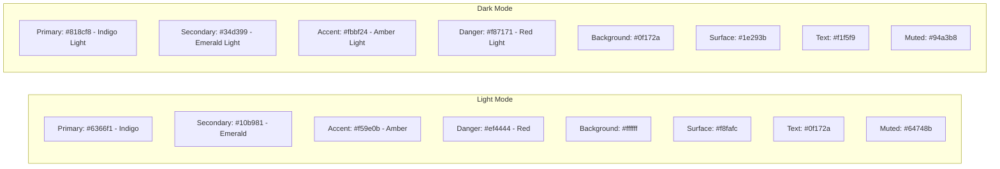

### 1.2 Typography

| Element | Font | Size | Weight | Usage |
|---------|------|------|--------|-------|
| H1 | Inter | 2rem (32px) | 700 | Page titles |
| H2 | Inter | 1.5rem (24px) | 600 | Section headers |
| H3 | Inter | 1.25rem (20px) | 600 | Card titles |
| Body | Inter | 0.875rem (14px) | 400 | Default text |
| Small | Inter | 0.75rem (12px) | 400 | Labels, captions |
| Mono | JetBrains Mono | 0.875rem | 400 | Code, IDs |

### 1.3 Spacing & Layout Tokens

```
Spacing scale: 4px base unit
  xs: 4px | sm: 8px | md: 16px | lg: 24px | xl: 32px | 2xl: 48px

Border radius:
  sm: 4px | md: 8px | lg: 12px | xl: 16px | full: 9999px

Shadows:
  sm: 0 1px 2px rgba(0,0,0,0.05)
  md: 0 4px 6px rgba(0,0,0,0.07)
  lg: 0 10px 15px rgba(0,0,0,0.1)
  xl: 0 20px 25px rgba(0,0,0,0.15)

Breakpoints:
  sm: 640px | md: 768px | lg: 1024px | xl: 1280px | 2xl: 1536px
```

### 1.4 Component Library (shadcn/ui)

| Component | Usage | Customization |
|-----------|-------|---------------|
| `Button` | Actions, form submit | Variants: primary, secondary, ghost, danger |
| `Card` | Dashboard stats, task cards | With header, content, footer slots |
| `Dialog` | Task detail, confirm actions | Modal + Sheet variants |
| `DropdownMenu` | User menu, action menus | With icons and shortcuts |
| `Table` | Member list, leaderboard | Sortable, filterable |
| `Tabs` | Dashboard sections, settings | Underline style |
| `Badge` | Status, priority, tags | Color-coded |
| `Avatar` | User avatars | With fallback initials |
| `Input` | Forms | With validation states |
| `Select` | Filters, dropdowns | Searchable variant |
| `Toast` | Notifications | Success, error, info |
| `Skeleton` | Loading states | Per-component skeletons |
| `Tooltip` | Help text, shortcuts | Delay: 300ms |
| `Command` | Search, quick actions | Cmd+K palette |
| `Sheet` | Mobile sidebar, detail panel | Left, right, bottom |

---

## 2. Layout Architecture

### 2.1 Root Layout Structure

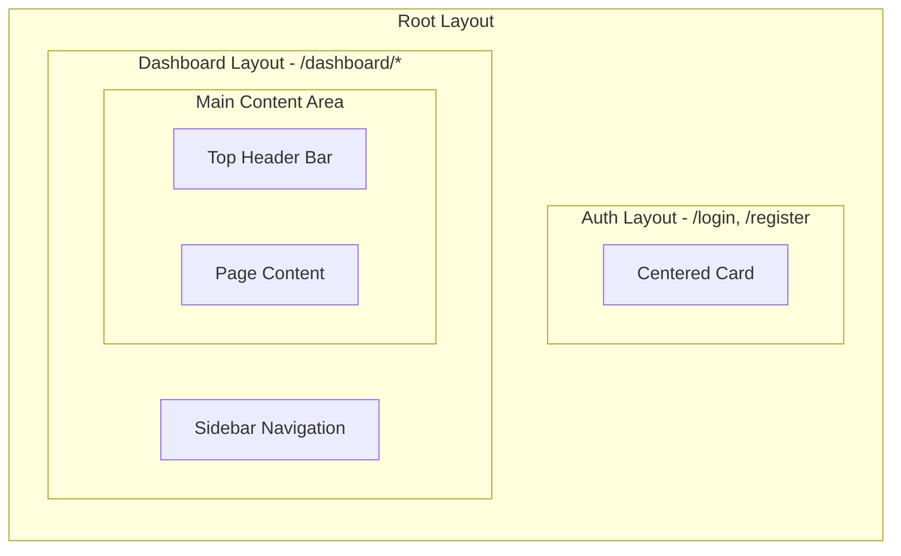

### 2.2 Dashboard Layout Detail

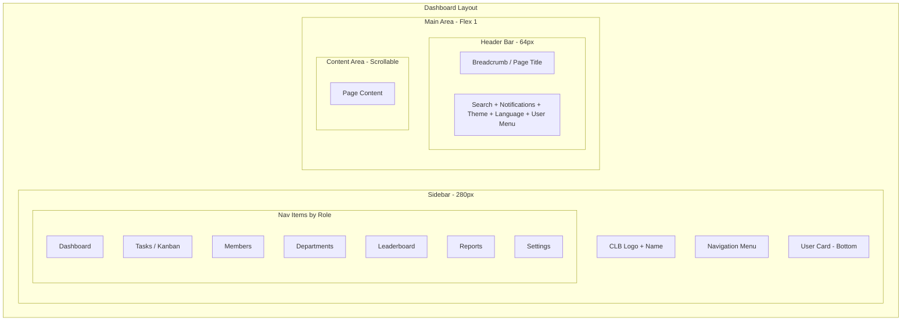

### 2.3 Sidebar Navigation Items by Role

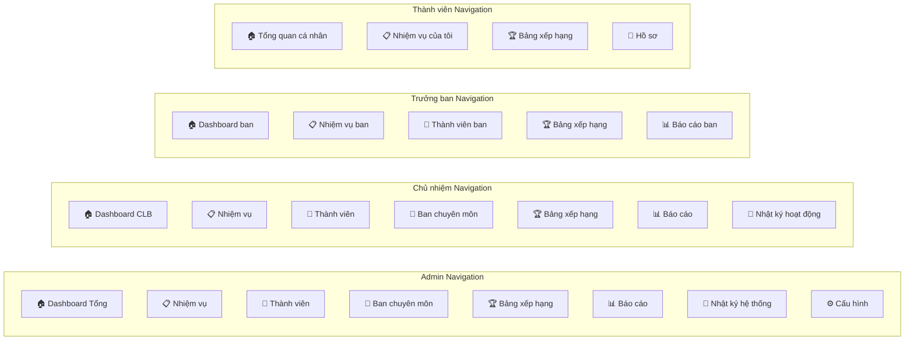

### 2.4 Mobile Layout

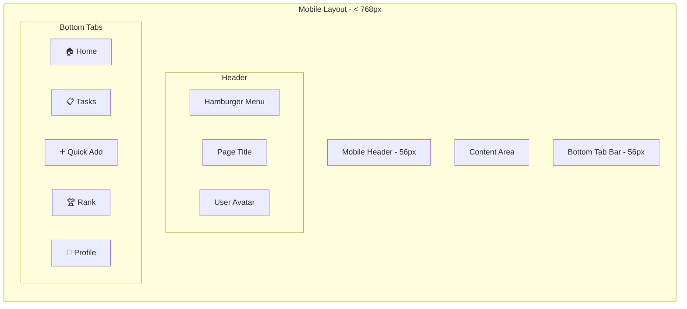

---

## 3. Component Hierarchy

### 3.1 Component Tree

```
App
├── Providers
│   ├── ThemeProvider (next-themes)
│   ├── IntlProvider (next-intl)
│   ├── AuthProvider (NextAuth SessionProvider)
│   ├── QueryProvider (TanStack QueryClientProvider)
│   └── SocketProvider (Socket.io context)
│
├── Layout
│   ├── AuthLayout
│   │   └── AuthCard
│   │
│   └── DashboardLayout
│       ├── Sidebar
│       │   ├── Logo
│       │   ├── NavMenu
│       │   │   ├── NavItem (role-based)
│       │   │   └── NavGroup
│       │   ├── UserCard
│       │   └── CollapseToggle
│       │
│       ├── Header
│       │   ├── Breadcrumb
│       │   ├── SearchCommand (Cmd+K)
│       │   ├── NotificationBell
│       │   ├── ThemeToggle
│       │   ├── LanguageSwitch
│       │   └── UserDropdown
│       │
│       └── Content (children)
│
├── Pages
│   ├── Dashboard
│   │   ├── StatsGrid
│   │   │   └── StatsCard (x4-6)
│   │   ├── TaskOverviewChart
│   │   ├── DepartmentProgressChart
│   │   ├── RecentActivityFeed
│   │   ├── UpcomingDeadlines
│   │   └── TopPerformers
│   │
│   ├── KanbanBoard
│   │   ├── KanbanToolbar
│   │   │   ├── FilterBar
│   │   │   ├── ViewToggle
│   │   │   └── CreateTaskButton
│   │   ├── KanbanContainer (DnD)
│   │   │   └── KanbanColumn (x4)
│   │   │       ├── ColumnHeader
│   │   │       └── KanbanCard (n)
│   │   │           ├── CardHeader
│   │   │           ├── CardBadges
│   │   │           ├── CardAssignees
│   │   │           └── CardFooter
│   │   └── TaskDetailSheet
│   │       ├── TaskHeader
│   │       ├── TaskDescription
│   │       ├── TaskMeta
│   │       ├── AssigneeSelector
│   │       ├── CommentSection
│   │       │   ├── CommentList
│   │       │   │   └── CommentItem
│   │       │   └── CommentInput
│   │       └── AttachmentList
│   │
│   ├── Members
│   │   ├── MemberToolbar
│   │   │   ├── SearchInput
│   │   │   ├── DepartmentFilter
│   │   │   ├── RoleFilter
│   │   │   └── InviteButton
│   │   ├── MemberTable
│   │   │   └── MemberRow
│   │   └── MemberDetailSheet
│   │
│   ├── Leaderboard
│   │   ├── LeaderboardHeader
│   │   ├── TopThree (Podium)
│   │   ├── LeaderboardTable
│   │   └── ProgressCharts
│   │
│   └── Reports
│       ├── ReportFilters
│       ├── ExportButton
│       └── ChartGrid
│
└── Shared
    ├── DataTable (reusable)
    ├── SearchFilter
    ├── FileUpload
    ├── EmptyState
    ├── ErrorBoundary
    ├── LoadingSpinner
    └── ConfirmDialog
```

### 3.2 Key Component Specifications

#### KanbanCard Component

```mermaid
graph TB
    subgraph KanbanCard[KanbanCard - 280px width]
        CARD_TOP[Top Section]
        CARD_MID[Middle Section]
        CARD_BOT[Bottom Section]

        subgraph Top[Top]
            PRIORITY_DOT[Priority Color Dot]
            TITLE[Task Title - 2 lines max]
            MENU[More Actions Menu]
        end

        subgraph Mid[Middle]
            TAGS[Tag Badges - max 3]
            DESC[Description Preview - 1 line]
        end

        subgraph Bottom[Bottom]
            DUE[Due Date Badge]
            ASSIGNEES[Avatar Stack - max 3]
            META[💬 5 | 📎 2]
        end
    end
```

#### StatsCard Component

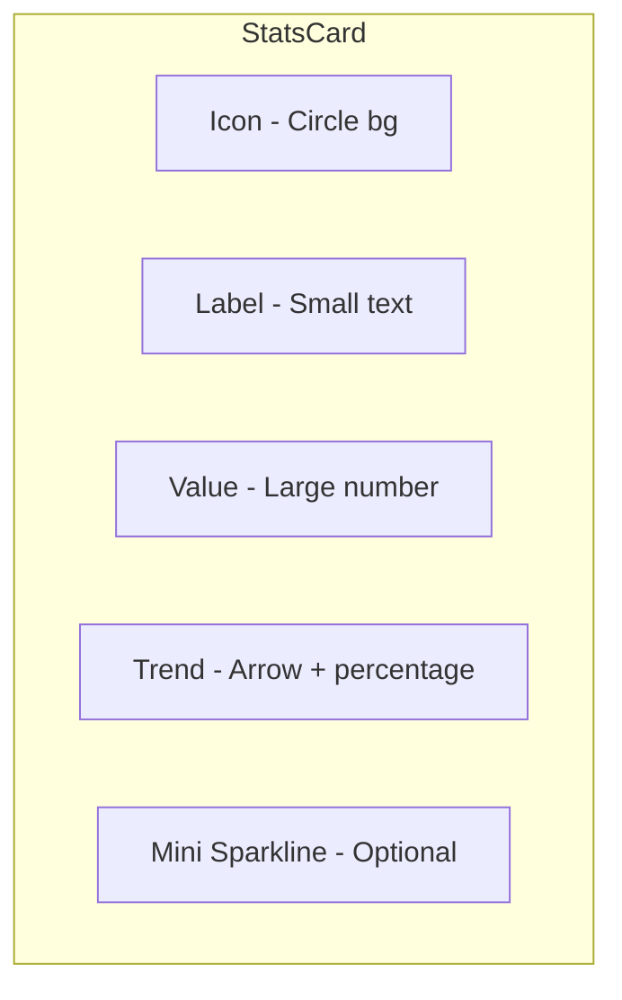

#### Dashboard Layout Grid

```mermaid
graph TB
    subgraph DashboardGrid[Dashboard Grid - 12 columns]
        ROW1[Row 1: Stats Cards - 4x col-3]
        ROW2[Row 2: Task Overview Chart - col-8 | Recent Activity - col-4]
        ROW3[Row 3: Department Progress - col-6 | Top Performers - col-6]
        ROW4[Row 4: Upcoming Deadlines - col-12]
    end
```

---

## 4. Page Designs

### 4.1 Login Page

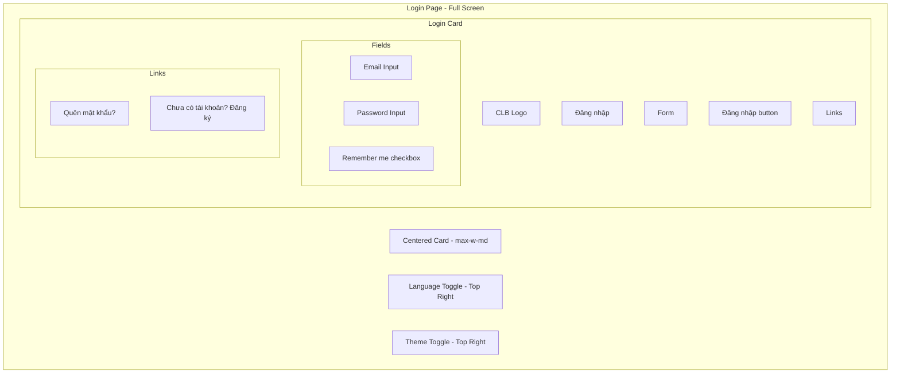

### 4.2 Dashboard Page (Role-Adaptive)

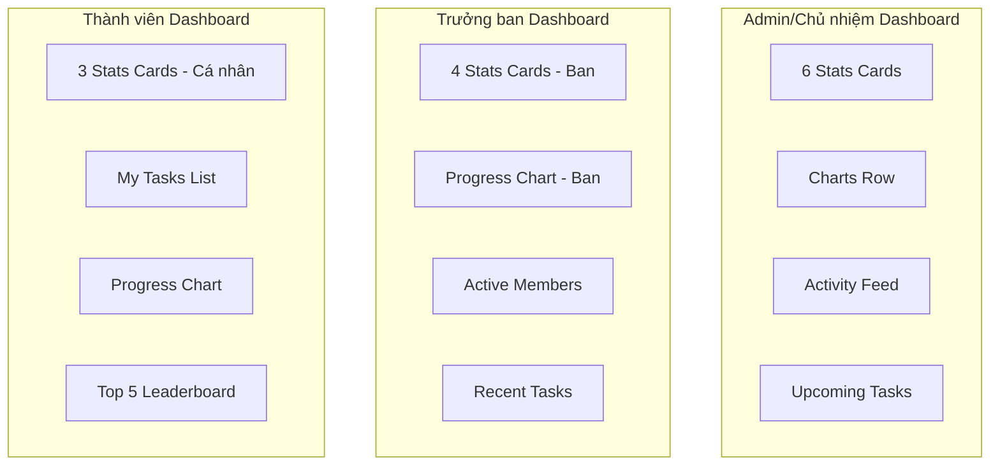

### 4.3 Kanban Board Page

```mermaid
graph TB
    subgraph KanbanPage[Kanban Board Page]
        TOOLBAR[Toolbar Row]
        BOARD[Board Area - Horizontal Scroll]

        subgraph Toolbar[Toolbar]
            SEARCH[Search tasks]
            FILTER_DEPT[Department filter]
            FILTER_PRIORITY[Priority filter]
            FILTER_ASSIGNEE[Assignee filter]
            VIEW[View toggle: Board | List]
            CREATE[+ Tạo nhiệm vụ]
        end

        subgraph Board[Board - 4 Columns]
            COL1[📋 Cần làm - TODO]
            COL2[🔄 Đang làm - IN_PROGRESS]
            COL3[👀 Đang xét duyệt - IN_REVIEW]
            COL4[✅ Hoàn thành - DONE]
        end

        subgraph Column[Each Column]
            COL_HEAD[Header: Title + Count + Add button]
            COL_BODY[Scrollable card list]
            COL_CARDS[KanbanCard x N]
        end
    end
```

### 4.4 Member Management Page

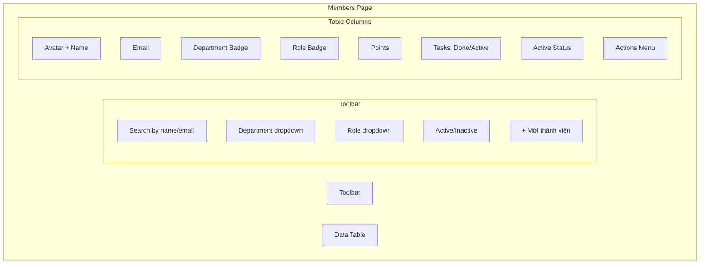

### 4.5 Leaderboard Page

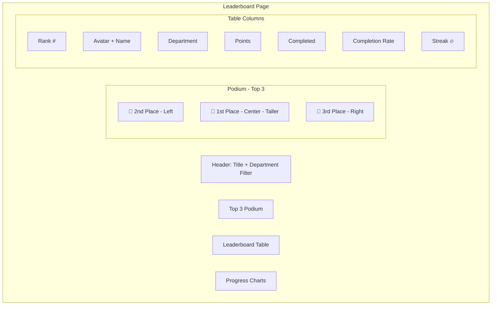

---

## 5. Responsive Strategy

### 5.1 Breakpoint Behavior

| Component | Mobile < 768px | Tablet 768-1024px | Desktop > 1024px |
|-----------|:--------------:|:-----------------:|:----------------:|
| Sidebar | Hidden (Sheet) | Collapsed (icons) | Full expanded |
| Header | Simplified | Full | Full |
| Kanban Board | 1 column scroll | 2 columns | 4 columns |
| Dashboard Grid | 1 column | 2 columns | 3-4 columns |
| Data Table | Card view | Scrollable table | Full table |
| Leaderboard | List only | List + mini podium | Full podium + table |
| Bottom Tab Bar | ✅ Visible | ❌ Hidden | ❌ Hidden |

### 5.2 Mobile-First Approach

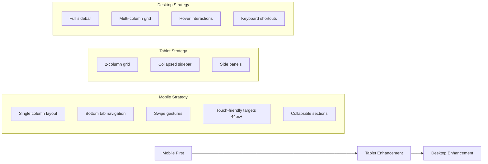

### 5.3 Touch Interactions

| Gesture | Action | Context |
|---------|--------|---------|
| Tap | Select/Open | Cards, buttons, links |
| Long Press | Context menu | Kanban cards, table rows |
| Swipe Left/Right | Navigate columns | Kanban board |
| Swipe Down | Pull to refresh | Lists, dashboard |
| Pinch | Zoom | Charts |

---

## 6. i18n Architecture

### 6.1 Translation Structure

```mermaid
graph TB
    subgraph i18n[i18n System]
        NEXT_INTL[next-intl Library]
        subgraph Routing[Routing Strategy]
            VI[/vi - Tiếng Việt]
            EN[/en - English]
        end

        subgraph TranslationFiles[Translation Files]
            COMMON[common.json - Shared strings]
            AUTH[auth.json - Login/Register]
            DASHBOARD[dashboard.json - Dashboard]
            TASKS[tasks.json - Kanban/Tasks]
            MEMBERS[members.json - Members]
            DEPARTMENTS[departments.json - Departments]
            LEADERBOARD[leaderboard.json - Leaderboard]
            REPORTS[reports.json - Reports]
            SETTINGS[settings.json - Settings]
        end

        NEXT_INTL --> Routing
        NEXT_INTL --> TranslationFiles
    end
```

### 6.2 Translation Key Structure

```json
// locales/vi/common.json
{
  "nav": {
    "dashboard": "Tổng quan",
    "tasks": "Nhiệm vụ",
    "members": "Thành viên",
    "departments": "Ban chuyên môn",
    "leaderboard": "Bảng xếp hạng",
    "reports": "Báo cáo",
    "settings": "Cài đặt"
  },
  "actions": {
    "create": "Tạo mới",
    "edit": "Chỉnh sửa",
    "delete": "Xóa",
    "save": "Lưu",
    "cancel": "Hủy",
    "search": "Tìm kiếm",
    "filter": "Lọc",
    "export": "Xuất file"
  },
  "status": {
    "todo": "Cần làm",
    "in_progress": "Đang làm",
    "in_review": "Đang xét duyệt",
    "done": "Hoàn thành"
  },
  "priority": {
    "low": "Thấp",
    "medium": "Trung bình",
    "high": "Cao",
    "urgent": "Khẩn cấp"
  },
  "roles": {
    "admin": "Quản trị viên",
    "chairman": "Chủ nhiệm CLB",
    "department_leader": "Trưởng ban",
    "member": "Thành viên"
  }
}
```

### 6.3 Language Switching Flow

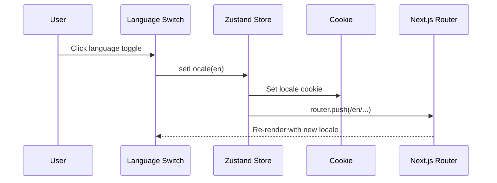

---

## 7. Theme System

### 7.1 Theme Architecture

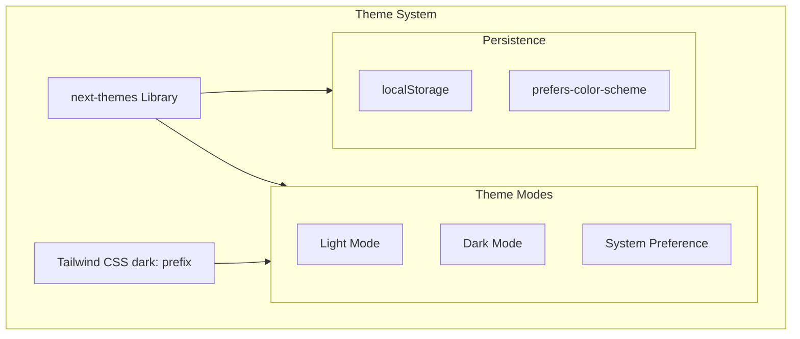

### 7.2 CSS Variable Strategy

```css
/* globals.css - Theme variables */
:root {
  --background: 0 0% 100%;
  --foreground: 222.2 84% 4.9%;
  --card: 0 0% 100%;
  --card-foreground: 222.2 84% 4.9%;
  --primary: 239 84% 67%;        /* #6366f1 */
  --primary-foreground: 210 40% 98%;
  --secondary: 160 84% 39%;      /* #10b981 */
  --accent: 38 92% 50%;          /* #f59e0b */
  --destructive: 0 84% 60%;     /* #ef4444 */
  --muted: 210 40% 96%;
  --muted-foreground: 215.4 16.3% 46.9%;
  --border: 214.3 31.8% 91.4%;
  --ring: 239 84% 67%;
  --radius: 0.5rem;
}

.dark {
  --background: 222.2 84% 4.9%;
  --foreground: 210 40% 98%;
  --card: 222.2 84% 4.9%;
  --card-foreground: 210 40% 98%;
  --primary: 239 84% 77%;        /* #818cf8 */
  --primary-foreground: 222.2 84% 4.9%;
  --secondary: 160 84% 49%;      /* #34d399 */
  --accent: 38 92% 60%;          /* #fbbf24 */
  --destructive: 0 84% 70%;     /* #f87171 */
  --muted: 217.2 32.6% 17.5%;
  --muted-foreground: 215 20.2% 65.1%;
  --border: 217.2 32.6% 17.5%;
  --ring: 239 84% 77%;
}
```

### 7.3 Theme Toggle Component

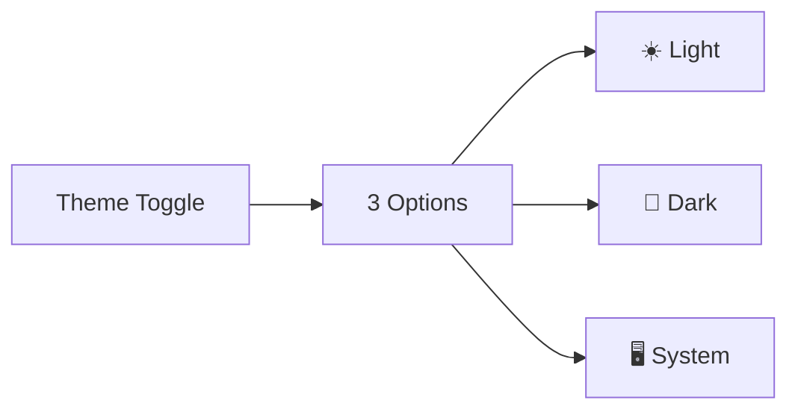

---

## 📊 Quyết Định UI/UX

| Quyết Định | Lựa Chọn | Lý Do | Phương Án Loại Bỏ |
|------------|----------|-------|-------------------|
| Component Library | shadcn/ui | Customizable, copy-paste, no vendor lock-in | ❌ Radix only (thiếu styled), ❌ MUI (nặng) |
| CSS Strategy | Tailwind + CSS Variables | Utility-first + theme tokens | ❌ CSS Modules (verbose), ❌ Styled Components (runtime) |
| Theme | next-themes + CSS vars | SSR-safe, system preference detect | ❌ Manual toggle (flash of wrong theme) |
| i18n | next-intl | App Router native, server/client support | ❌ react-i18next (client-only) |
| Layout Pattern | Nested layouts (App Router) | Shared sidebar, per-page content | ❌ HOC wrappers (complex) |
| Mobile Navigation | Bottom tab bar | Native app feel, thumb-friendly | ❌ Hamburger only (hidden nav) |
| Data Table | shadcn Table + TanStack Table | Sorting, filtering, pagination built-in | ❌ Custom table (reinventing wheel) |
| Charts | Recharts | React-native, declarative, responsive | ❌ Chart.js (canvas), ❌ D3 (overkill) |
| Drag & Drop | @hello-pangea/dnd | Accessible, performant, maintained fork | ❌ dnd-kit (complex API) |
| Form Handling | React Hook Form + Zod | Performant, minimal re-renders, type-safe | ❌ Formik (more re-renders) |
| Toast/Notification | Sonner (shadcn) | Lightweight, beautiful defaults | ❌ react-hot-toast (less polished) |
| Command Palette | cmdk (shadcn) | Cmd+K search, keyboard-first UX | ❌ Custom search (more work) |

---

## 🎯 UX Principles

1. **Progressive Disclosure** - Hiển thị thông tin theo mức độ quan trọng
2. **Consistent Navigation** - Sidebar cố định, breadcrumb rõ ràng
3. **Immediate Feedback** - Optimistic updates, loading skeletons, toast notifications
4. **Keyboard First** - Cmd+K search, keyboard shortcuts cho power users
5. **Accessible** - ARIA labels, focus management, screen reader support
6. **Performance** - Code splitting, lazy loading, skeleton loading states
7. **Error Recovery** - Clear error messages, retry actions, undo support

> **Bước tiếp theo:** Xem chi tiết Implementation Roadmap tại [`05-implementation-roadmap.md`](plans/05-implementation-roadmap.md).
