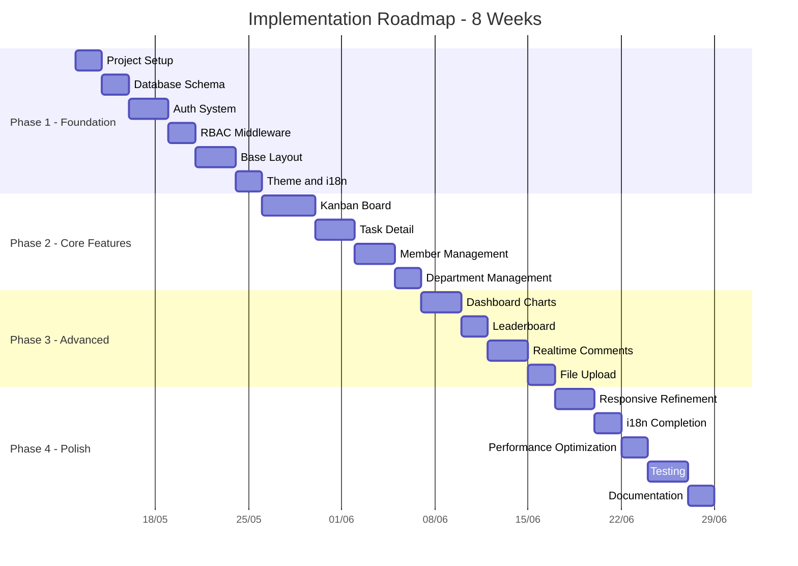
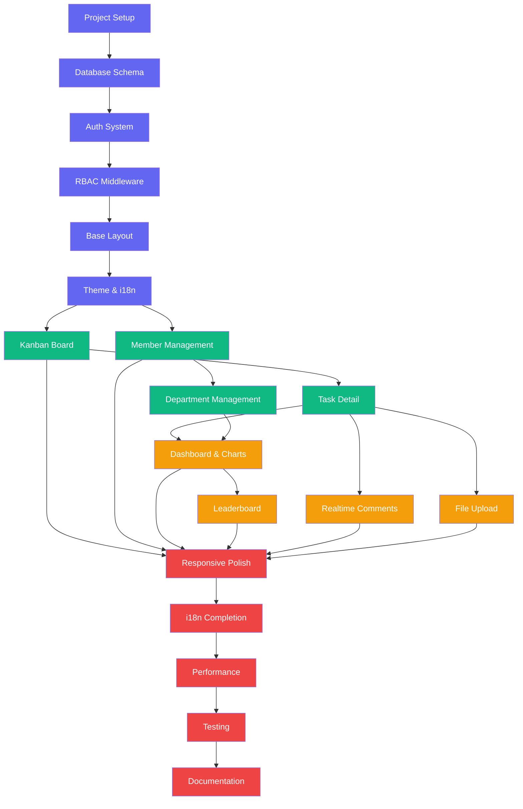
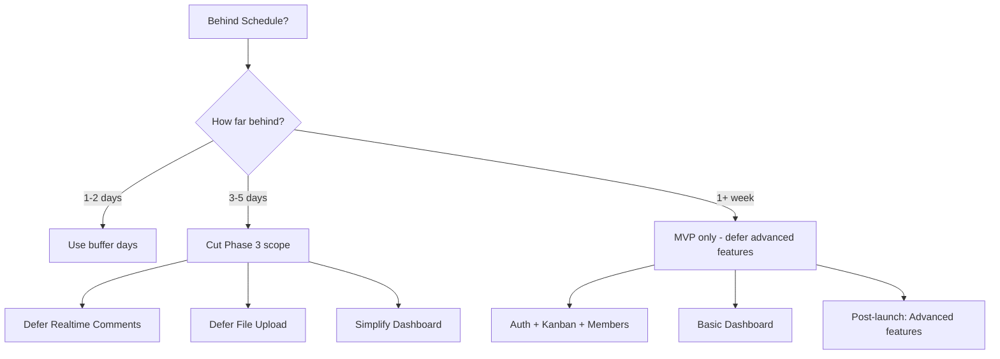

# 🚀 Implementation Roadmap - CLB Khởi Nghiệp Đổi Mới Sáng Tạo

## 📋 Mục Lục

1. [Tổng Quan Timeline](#1-tổng-quan-timeline)
2. [Phase 1: Foundation](#2-phase-1-foundation)
3. [Phase 2: Core Features](#3-phase-2-core-features)
4. [Phase 3: Advanced Features](#4-phase-3-advanced-features)
5. [Phase 4: Polish & Launch](#5-phase-4-polish--launch)
6. [Dependency Graph](#6-dependency-graph)
7. [Risk Mitigation](#7-risk-mitigation)

---

## 1. Tổng Quan Timeline

### Milestone Summary

| Phase | Thời Gian | Deliverables | Điểm Mấu Chốt |
|-------|-----------|-------------|----------------|
| **Phase 1** | Tuần 1-2 (10 ngày) | Auth, Layout, DB, Theme, i18n | Nền tảng kỹ thuật hoàn chỉnh |
| **Phase 2** | Tuần 3-4 (12 ngày) | Kanban, Members, Departments | Chức năng cốt lõi hoạt động |
| **Phase 3** | Tuần 5-6 (10 ngày) | Dashboard, Leaderboard, Realtime | Trải nghiệm nâng cao |
| **Phase 4** | Tuần 7-8 (12 ngày) | Polish, Test, Docs | Sẵn sàng ra mắt |

---

## 2. Phase 1: Foundation (Tuần 1-2)

### 2.1 Project Setup

**Thời gian:** 2 ngày | **Dependencies:** Không

| Task | Chi Tiết | Output |
|------|----------|--------|
| Init Next.js project | `npx create-next-app@latest` với TypeScript, Tailwind, App Router, src/ | Project skeleton |
| Install dependencies | shadcn/ui, Prisma, NextAuth, Zustand, React Query, next-intl, Recharts, @hello-pangea/dnd, Zod, Socket.io | `package.json` |
| Setup shadcn/ui | `npx shadcn@latest init` + install components | UI component library |
| Setup ESLint + Prettier | Config code quality rules | `.eslintrc.json`, `.prettierrc` |
| Setup environment | `.env.example` với DATABASE_URL, NEXTAUTH_SECRET, etc. | `.env.local` |
| Git setup | `.gitignore`, initial commit, branch strategy | Git repo ready |

**Verification:** `npm run dev` chạy thành công, shadcn components render được.

### 2.2 Database Schema

**Thời gian:** 2 ngày | **Dependencies:** Project Setup

| Task | Chi Tiết | Output |
|------|----------|--------|
| Write Prisma schema | Copy schema từ [`01-database-schema.md`](plans/01-database-schema.md) | `prisma/schema.prisma` |
| Setup PostgreSQL | Local Docker hoặc cloud (Neon/Supabase) | Database running |
| Run migrations | `npx prisma migrate dev --name init` | Migration files |
| Generate Prisma client | `npx prisma generate` | Type-safe client |
| Write seed script | Admin account, departments, sample data | `prisma/seed.ts` |
| Run seed | `npx prisma db seed` | Populated database |

**Verification:** `npx prisma studio` hiển thị dữ liệu mẫu.

### 2.3 Auth System

**Thời gian:** 3 ngày | **Dependencies:** Database Schema

| Task | Chi Tiết | Output |
|------|----------|--------|
| Configure NextAuth v5 | Credentials provider, Prisma adapter | `src/lib/auth.ts` |
| Auth API routes | `/api/auth/[...nextauth]` | Auth endpoints |
| Register endpoint | POST `/api/auth/register` với Zod validation | Registration flow |
| Login page | Form với email/password, validation | `/login` page |
| Register page | Form với name/email/password | `/register` page |
| Session types | Extend session types với role, departmentId | Type definitions |
| Password hashing | bcrypt integration | Security layer |

**Verification:** Đăng ký + đăng nhập hoạt động, session chứa role info.

### 2.4 RBAC Middleware

**Thời gian:** 2 ngày | **Dependencies:** Auth System

| Task | Chi Tiết | Output |
|------|----------|--------|
| Permission definitions | Copy từ [`02-rbac-design.md`](plans/02-rbac-design.md) | `src/server/guards/permissions.ts` |
| RBAC guard functions | `hasPermission`, `checkDepartmentAccess` | `src/server/guards/rbac.ts` |
| Next.js middleware | Route protection, role-based redirects | `src/middleware.ts` |
| API route guards | `withPermission`, `withDepartmentScope` HOFs | `src/server/guards/api-guard.ts` |
| Test all 4 roles | Verify each role sees correct pages | Manual testing |

**Verification:** Admin thấy tất cả, Member chỉ thấy trang cá nhân, 403 cho unauthorized.

### 2.5 Base Layout

**Thời gian:** 3 ngày | **Dependencies:** RBAC Middleware

| Task | Chi Tiết | Output |
|------|----------|--------|
| Root layout | Providers (Theme, Intl, Auth, Query, Socket) | `src/app/layout.tsx` |
| Auth layout | Centered card layout cho login/register | `src/app/[locale]/(auth)/layout.tsx` |
| Dashboard layout | Sidebar + Header + Content area | `src/app/[locale]/(dashboard)/layout.tsx` |
| Sidebar component | Role-based navigation items, collapse toggle | `src/components/layout/Sidebar.tsx` |
| Header component | Breadcrumb, search, theme/lang toggles, user menu | `src/components/layout/Header.tsx` |
| Mobile nav | Bottom tab bar + hamburger menu | `src/components/layout/MobileNav.tsx` |
| User dropdown | Profile, settings, logout | `src/components/layout/UserDropdown.tsx` |

**Verification:** Layout responsive trên mobile/tablet/desktop, sidebar items thay đổi theo role.

### 2.6 Theme & i18n

**Thời gian:** 2 ngày | **Dependencies:** Base Layout

| Task | Chi Tiết | Output |
|------|----------|--------|
| Theme setup | next-themes + CSS variables cho light/dark | Theme system |
| Theme toggle | Sun/Moon/System icons trong header | `src/components/layout/ThemeToggle.tsx` |
| i18n setup | next-intl config, middleware integration | i18n system |
| Vietnamese translations | All common, auth, nav strings | `messages/vi.json` |
| English translations | All common, auth, nav strings | `messages/en.json` |
| Language switch | Toggle button trong header | `src/components/layout/LanguageSwitch.tsx` |

**Verification:** Chuyển đổi theme mượt, chuyển đổi ngôn ngữ cập nhật toàn bộ UI.

---

## 3. Phase 2: Core Features (Tuần 3-4)

### 3.1 Kanban Board

**Thời gian:** 4 ngày | **Dependencies:** Phase 1 complete

| Task | Chi Tiết | Output |
|------|----------|--------|
| Task service layer | CRUD operations, position management | `src/server/services/task.service.ts` |
| Task API routes | GET/POST/PUT/DELETE/PATCH endpoints | `src/app/api/tasks/` |
| Task Zod schemas | Validation cho create, update, move | `src/schemas/task.schema.ts` |
| KanbanBoard component | 4-column layout, horizontal scroll | `src/components/kanban/KanbanBoard.tsx` |
| KanbanColumn component | Column header, card list, add button | `src/components/kanban/KanbanColumn.tsx` |
| KanbanCard component | Title, badges, assignees, due date | `src/components/kanban/KanbanCard.tsx` |
| DnD integration | @hello-pangea/dnd, cross-column drag | Drag & drop logic |
| Optimistic updates | Immediate UI feedback, rollback on error | UX enhancement |
| Filter toolbar | Department, priority, assignee filters | `src/components/kanban/KanbanToolbar.tsx` |
| Create task dialog | Form với all fields | `src/components/kanban/CreateTaskDialog.tsx` |

**Verification:** Kéo thả cards mượt, filter hoạt động, tạo task thành công.

### 3.2 Task Detail

**Thời gian:** 3 ngày | **Dependencies:** Kanban Board

| Task | Chi Tiết | Output |
|------|----------|--------|
| Task detail sheet | Slide-over panel với full task info | `src/components/kanban/TaskDetailSheet.tsx` |
| Task header | Title edit, status badge, priority badge | Header section |
| Task description | Rich text display, inline edit | Description section |
| Task metadata | Due date picker, department, tags | Metadata section |
| Assignee selector | Multi-select dropdown, search | `src/components/kanban/AssigneeSelector.tsx` |
| Comment section | List + input, nested replies | `src/components/shared/CommentSection.tsx` |
| Comment API | CRUD endpoints cho comments | `src/app/api/tasks/[id]/comments/` |
| Attachment list | Display attached files, download | `src/components/kanban/AttachmentList.tsx` |
| Activity timeline | Task history log | Timeline component |

**Verification:** Mở task detail, thêm comment, gán người phụ trách, tất cả hoạt động.

### 3.3 Member Management

**Thời gian:** 3 ngày | **Dependencies:** Phase 1 complete

| Task | Chi Tiết | Output |
|------|----------|--------|
| Member service layer | CRUD, role/department management | `src/server/services/member.service.ts` |
| Member API routes | All endpoints từ [`03-api-design.md`](plans/03-api-design.md) | `src/app/api/members/` |
| Member list page | Data table với search, filter, sort | `/members` page |
| Member table component | Avatar, name, dept, role, points, actions | `src/components/members/MemberTable.tsx` |
| Member detail sheet | Full profile view/edit | `src/components/members/MemberDetailSheet.tsx` |
| Invite member dialog | Create account form (Admin/Chairman only) | Invite flow |
| Role management | Change role dropdown (Admin only) | Role UI |
| Department assignment | Transfer member between departments | Assignment UI |

**Verification:** Danh sách hiển thị đúng theo role scope, CRUD hoạt động.

### 3.4 Department Management

**Thời gian:** 2 ngày | **Dependencies:** Member Management

| Task | Chi Tiết | Output |
|------|----------|--------|
| Department service | CRUD, member management | `src/server/services/department.service.ts` |
| Department API routes | All endpoints | `src/app/api/departments/` |
| Department list page | Card grid với stats | `/departments` page |
| Department detail page | Members, tasks, stats cho department | `/departments/[id]` page |
| Create/edit department | Form dialog | Department form |
| Assign leader | Select leader from members | Leader assignment |

**Verification:** Tạo ban mới, phân công trưởng ban, xem thành viên ban.

---

## 4. Phase 3: Advanced Features (Tuần 5-6)

### 4.1 Dashboard & Charts

**Thời gian:** 3 ngày | **Dependencies:** Phase 2 complete

| Task | Chi Tiết | Output |
|------|----------|--------|
| Stats service layer | Aggregation queries cho dashboard | `src/server/services/stats.service.ts` |
| Stats API routes | Club, department, personal stats | `src/app/api/stats/` |
| StatsCard component | Icon, label, value, trend, sparkline | `src/components/dashboard/StatsCard.tsx` |
| TaskOverview chart | Pie/donut chart cho task status | Recharts component |
| DepartmentProgress chart | Bar chart cho departments | Recharts component |
| WeeklyProgress chart | Line chart cho weekly trends | Recharts component |
| RecentActivity feed | Scrollable activity list | `src/components/dashboard/RecentActivity.tsx` |
| UpcomingDeadlines | List of tasks due soon | `src/components/dashboard/UpcomingDeadlines.tsx` |
| Role-adaptive dashboard | Different layouts per role | Conditional rendering |

**Verification:** Dashboard hiển thị số liệu chính xác, charts responsive.

### 4.2 Leaderboard

**Thời gian:** 2 ngày | **Dependencies:** Stats service

| Task | Chi Tiết | Output |
|------|----------|--------|
| Leaderboard query | Points-based ranking với tiebreakers | Database query |
| Leaderboard API | GET `/api/stats/leaderboard` | API endpoint |
| Podium component | Top 3 với visual podium | `src/components/leaderboard/Podium.tsx` |
| Leaderboard table | Rank, avatar, name, dept, points, stats | `src/components/leaderboard/LeaderboardTable.tsx` |
| Department filter | Filter leaderboard by department | Filter UI |
| Progress charts | Individual progress visualization | Charts |
| Points system | Auto-calculate points từ task completion | Scoring algorithm |

**Verification:** Bảng xếp hạng hiển thị đúng, points tính toán chính xác.

### 4.3 Realtime Comments

**Thời gian:** 3 ngày | **Dependencies:** Task Detail

| Task | Chi Tiết | Output |
|------|----------|--------|
| Socket.io server setup | Next.js custom server hoặc standalone | `src/lib/socket.ts` |
| Socket client hook | Connect, join rooms, event listeners | `src/hooks/useSocket.ts` |
| Comment realtime | New/updated/deleted comments appear instantly | Realtime flow |
| Online presence | Show who's viewing a task | Presence indicator |
| Notification events | Toast cho new comments on viewed tasks | Notification system |

**Verification:** Mở 2 browsers, thêm comment ở 1 bên, bên kia cập nhật tức thì.

### 4.4 File Upload

**Thời gian:** 2 ngày | **Dependencies:** Task Detail

| Task | Chi Tiết | Output |
|------|----------|--------|
| Uploadthing setup | Configure upload router | `src/lib/uploadthing.ts` |
| FileUpload component | Drag & drop zone, progress bar | `src/components/shared/FileUpload.tsx` |
| Attachment API | Link attachments to tasks/comments | API endpoints |
| File preview | Image preview, file type icons | Preview UI |
| Download functionality | Secure download links | Download flow |

**Verification:** Upload file, đính kèm vào task, download lại thành công.

---

## 5. Phase 4: Polish & Launch (Tuần 7-8)

### 5.1 Responsive Refinement

**Thời gian:** 3 ngày

| Task | Chi Tiết |
|------|----------|
| Mobile Kanban | Single column view với swipe navigation |
| Mobile tables | Convert to card view trên mobile |
| Touch interactions | Long press context menus, swipe gestures |
| Bottom sheet | Replace dialogs với bottom sheets trên mobile |
| Viewport testing | Test trên các kích thước phổ biến |

### 5.2 i18n Completion

**Thời gian:** 2 ngày

| Task | Chi Tiết |
|------|----------|
| Audit translations | Đảm bảo tất cả strings đều có translation |
| Dynamic content | Translate department names, task tags |
| Date formatting | Locale-aware date/time display |
| Number formatting | Locale-aware number display |
| RTL preparation | Layout không break nếu cần RTL trong tương lai |

### 5.3 Performance Optimization

**Thời gian:** 2 ngày

| Task | Chi Tiết |
|------|----------|
| Code splitting | Lazy load heavy components (charts, kanban) |
| Image optimization | next/image cho avatars, logos |
| Bundle analysis | `@next/bundle-analyzer` để identify large bundles |
| Database query optimization | N+1 query detection, add missing indexes |
| Caching strategy | React Query staleTime, API response caching |
| Loading states | Skeleton components cho mọi page |

### 5.4 Testing

**Thời gian:** 3 ngày

| Task | Chi Tiết | Coverage |
|------|----------|----------|
| Unit tests - Services | Task, Member, Department services | Core business logic |
| Unit tests - Guards | RBAC permission checks | Security layer |
| Integration tests - API | All API endpoints với auth | API contracts |
| E2E tests - Auth flow | Login, register, role-based redirect | Critical paths |
| E2E tests - Kanban | Create task, drag, assign, comment | Core feature |
| E2E tests - Members | CRUD, role change, department transfer | Member management |

### 5.5 Documentation

**Thời gian:** 2 ngày

| Task | Chi Tiết |
|------|----------|
| README.md | Setup guide, tech stack, architecture overview |
| API documentation | Endpoint docs với request/response examples |
| Deployment guide | Vercel/Docker deployment instructions |
| Contributing guide | Code conventions, PR process |
| User guide | Hướng dẫn sử dụng cho từng vai trò |

---

## 6. Dependency Graph

---

## 7. Risk Mitigation

### 7.1 Technical Risks

| Rủi Ro | Xác Suất | Tác Động | Mitigation |
|--------|:--------:|:--------:|------------|
| DnD library compatibility | 🟡 Medium | 🟡 Medium | Prototype early trong Phase 2, fallback to dnd-kit |
| Socket.io SSR issues | 🟡 Medium | 🟡 Medium | Client-only Socket, lazy initialization |
| Prisma N+1 queries | 🟡 Medium | 🟢 Low | Use `include`/`select`, monitor query logs |
| Auth session edge cases | 🟢 Low | 🔴 High | Thorough testing, session refresh logic |
| i18n missing translations | 🟢 Low | 🟢 Low | Fallback to Vietnamese, CI check for completeness |

### 7.2 Schedule Risks

| Rủi Ro | Xác Suất | Tác Động | Mitigation |
|--------|:--------:|:--------:|------------|
| Kanban DnD takes longer | 🟡 Medium | 🟡 Medium | Allocate extra buffer day, simplify if needed |
| Realtime complexity | 🟡 Medium | 🟢 Low | Phase 3 feature, can be deferred to post-launch |
| Testing takes longer | 🟡 Medium | 🟢 Low | Focus on critical path tests first |
| Scope creep | 🟡 Medium | 🔴 High | Strict feature freeze after Phase 2 |

### 7.3 Contingency Plan

---

## 📊 Definition of Done

### Phase 1 DoD
- [ ] Auth hoạt động cho tất cả 4 roles
- [ ] Layout responsive trên mobile/tablet/desktop
- [ ] Theme light/dark chuyển đổi mượt
- [ ] i18n VI/EN hoạt động
- [ ] Database seeded với sample data

### Phase 2 DoD
- [ ] Kanban board kéo thả 4 cột
- [ ] Task CRUD với đầy đủ fields
- [ ] Comment trên task
- [ ] Member list với filter/search
- [ ] Department CRUD

### Phase 3 DoD
- [ ] Dashboard với charts cho từng role
- [ ] Leaderboard tính điểm tự động
- [ ] Realtime comments hoạt động
- [ ] File upload/download hoạt động

### Phase 4 DoD
- [ ] Responsive trên mọi device phổ biến
- [ ] Tất cả strings được translate
- [ ] Performance score > 90 (Lighthouse)
- [ ] Test coverage > 70%
- [ ] Documentation hoàn chỉnh

---

## 🏆 Quyết Định Lập Kế Hoạch

| Quyết Định | Lựa Chọn | Lý Do | Phương Án Loại Bỏ |
|------------|----------|-------|-------------------|
| Timeline | 8 tuần | Đủ cho 1 developer full-stack, bao gồm testing | ❌ 4 tuần (quá ít), ❌ 12 tuần (quá dài) |
| Phasing | 4 phases | Incremental delivery, mỗi phase có demo được | ❌ Big bang (rủi ro cao) |
| Priority | Kanban > Members > Dashboard | Core value proposition trước | ❌ Dashboard first (thiếu data) |
| Testing strategy | Phase 4 tập trung | Đợi features stable rồi test | ❌ TDD (chậm hơn cho solo dev) |
| Realtime | Phase 3 (nice-to-have) | Có thể defer nếu behind schedule | ❌ Phase 2 (block core features) |

> **Tài liệu kiến trúc hoàn chỉnh.** Xem tất cả plans tại thư mục [`/plans/`](plans/).
