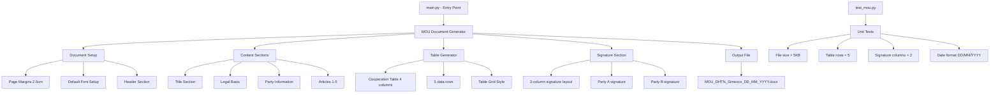

# KẾ HOẠCH: Tạo File MOU (.docx) Bằng Python

## 📋 Tổng Quan Dự Án

**Mục tiêu**: Tạo file Word (.docx) chứa Bản Ghi Nhớ Hợp Tác (MOU) giữa Trường Đại học Tây Nguyên và Simexco Daklak, với định dạng chuyên nghiệp và đầy đủ nội dung.

**Công nghệ**: Python 3.10+ với thư viện `python-docx`

---

## 🏗️ Kiến Trúc Hệ Thống



---

## 📁 Cấu Trúc File

```
Desktop/
├── plans/
│   └── mou-docx-generator-plan.md  (file này)
├── mou_generator/
│   ├── __init__.py
│   ├── main.py                    # Entry point chính
│   ├── document_builder.py        # Class xây dựng document
│   ├── styles.py                  # Định nghĩa styles và fonts
│   ├── content_sections.py        # Các phần nội dung MOU
│   ├── table_generator.py         # Tạo bảng điều khoản
│   ├── signature_section.py       # Phần chữ ký
│   ├── config.py                  # Cấu hình và hằng số
│   └── tests/
│       ├── __init__.py
│       └── test_mou_generator.py  # Unit tests
├── requirements.txt               # Dependencies
└── README.md                      # Hướng dẫn sử dụng
```

---

## 🔧 Chi Tiết Từng Module

### 1. `config.py` - Cấu Hình

```python
# Các hằng số cấu hình
FONT_PRIMARY = "Times New Roman"
FONT_FALLBACK = "Arial"  # hoặc Calibri
FONT_SIZE_BODY = 13
FONT_SIZE_TITLE = 16
FONT_SIZE_HEADER = 12
MARGIN_CM = 2.5  # cm cho tất cả các cạnh

# Thông tin các bên
PARTY_A = {
    "name": "Trường Đại học Tây Nguyên",
    "address": "Số 567, Lê Duẩn, P. Ea Kao, TP. Buôn Ma Thuột, Đắk Lắk",
    "representative": "Hiệu trưởng hoặc Phó Hiệu trưởng được ủy quyền"
}

PARTY_B = {
    "name": "Công ty TNHH MTV Xuất nhập khẩu 2-9 Đắk Lắk",
    "short_name": "Simexco Daklak",
    "address": "23 Ngô Quyền, P. Thắng Lợi, TP. Buôn Ma Thuột, Đắk Lắk",
    "representative": "Giám đốc điều hành hoặc Giám đốc"
}

# Nội dung bảng hợp tác
COOPERATION_TABLE_DATA = [
    {
        "stt": 1,
        "field": "Đào tạo & Chia sẻ chuyên môn",
        "party_a": "Tổ chức workshop, talkshow, tọa đàm theo nhu cầu của Bên B",
        "party_b": "Cử diễn giả tham gia tối thiểu 2 lần/năm học; chia sẻ thực tế về xu hướng khởi nghiệp"
    },
    # ... thêm 4 dòng nữa
]
```

### 2. `styles.py` - Quản Lý Styles

**Chức năng chính:**
- Thiết lập font mặc định cho document
- Kiểm tra và fallback font nếu Times New Roman không khả dụng
- Tạo styles cho tiêu đề, nội dung, bảng

**Xử lý lỗi font:**
```python
def get_font_name():
    """Kiểm tra font khả dụng, fallback nếu cần"""
    try:
        # Thử sử dụng Times New Roman
        return "Times New Roman"
    except:
        print("WARNING: Times New Roman không khả dụng, sử dụng Arial")
        return "Arial"
```

### 3. `document_builder.py` - Xây Dựng Document

**Luồng xử lý:**
1. Tạo document mới với `Document()`
2. Thiết lập margins (2.5cm tất cả)
3. Thiết lập default font
4. Gọi các section theo thứ tự:
   - Header (CỘNG HÒA XÃ HỘI...)
   - Title (BẢN GHI NHỚ HỢP TÁC)
   - Legal basis (Căn cứ...)
   - Party information
   - Article 1: Đối tượng, mục tiêu
   - Article 2: Nội dung hợp tác (BẢNG)
   - Article 3: Thời hạn, hiệu lực
   - Article 4: Điều khoản chung
   - Article 5: Cam kết
   - Signature section

### 4. `content_sections.py` - Các Phần Nội dung

**Cấu trúc hàm:**
```python
def add_header_section(doc):
    """Thêm dòng CỘNG HÒA XÃ HỘI CHỦ NGHĨA VIỆT NAM"""
    # Căn giữa, cỡ 12, không in đậm

def add_title_section(doc):
    """Thêm tiêu đề BẢN GHI NHỚ HỢP TÁC"""
    # Căn giữa, cỡ 16, in đậm

def add_legal_basis(doc):
    """Thêm phần căn cứ pháp lý"""
    # 3 dòng căn cứ

def add_party_info(doc):
    """Thêm thông tin các bên"""
    # Bên A và Bên B

def add_article_1(doc):
    """Điều 1: Đối tượng, mục tiêu, phạm vi"""

def add_article_3(doc):
    """Điều 3: Thời hạn, hiệu lực"""

def add_article_4(doc):
    """Điều 4: Điều khoản chung"""

def add_article_5(doc):
    """Điều 5: Cam kết"""
```

### 5. `table_generator.py` - Tạo Bảng Hợp Tác

**Yêu cầu kỹ thuật:**
- 4 cột: STT | Lĩnh vực | Cam kết Bên A | Cam kết Bên B
- 5 dòng dữ liệu + 1 dòng tiêu đề
- Style: Table Grid (viền đen đầy đủ)
- Tiêu đề cột in đậm
- Font size 13

**Cấu trúc bảng:**
```python
def create_cooperation_table(doc):
    """Tạo bảng Điều 2 với 4 cột, 6 hàng"""
    table = doc.add_table(rows=6, cols=4)
    table.style = 'Table Grid'
    
    # Header row
    headers = ["STT", "Lĩnh vực", "Cam kết của Bên A", "Cam kết của Bên B"]
    
    # Data rows (5 rows)
    data = [
        [1, "Đào tạo & Chia sẻ chuyên môn", "...", "..."],
        [2, "Thực tập & Phát triển nguồn nhân lực", "...", "..."],
        [3, "Trải nghiệm doanh nghiệp", "...", "..."],
        [4, "Tư vấn & Hỗ trợ dự án khởi nghiệp", "...", "..."],
        [5, "Truyền thông & Hợp tác phát triển", "...", "..."]
    ]
```

### 6. `signature_section.py` - Phần Chữ Ký

**Yêu cầu:**
- Bảng 2 cột (Bên A | Bên B)
- Có dòng kẻ để ký tên
- Có ghi chú "ĐẠI DIỆN BÊN A" và "ĐẠI DIỆN BÊN B"
- Placeholder ngày tháng

**Cấu trúc:**
```python
def add_signature_section(doc):
    """Thêm phần chữ ký cuối file"""
    # Tạo bảng 2 cột
    # Cột trái: Đại diện Bên A
    # Cột phải: Đại diện Bên B
    # Dòng ngày tháng ở dưới
```

### 7. `main.py` - Entry Point

**Chức năng:**
- Import và gọi `document_builder`
- Tạo tên file với ngày tháng hiện tại
- Lưu file và thông báo đường dẫn
- Chạy unit test (tùy chọn)

```python
def main():
    """Hàm chính tạo file MOU"""
    from datetime import datetime
    
    # Lấy ngày hiện tại
    now = datetime.now()
    filename = f"MOU_DHTN_Simexco_{now.day:02d}_{now.month:02d}_{now.year}.docx"
    
    # Tạo document
    doc = build_mou_document()
    
    # Lưu file
    doc.save(filename)
    print(f"Đã tạo file: {filename}")
```

---

## 🧪 Unit Tests

### Test Cases:

1. **test_file_creation**
   - Kiểm tra file được tạo thành công
   - Dung lượng file > 5KB

2. **test_table_structure**
   - Bảng có đúng 6 hàng (1 header + 5 data)
   - Bảng có đúng 4 cột
   - Style là Table Grid

3. **test_signature_section**
   - Phần chữ ký có 2 cột
   - Có đủ tên Bên A và Bên B

4. **test_date_format**
   - Ngày tháng đúng định dạng DD/MM/YYYY
   - Sử dụng ngày hiện tại của hệ thống

5. **test_font_settings**
   - Font chính là Times New Roman (hoặc fallback)
   - Cỡ chữ body là 13
   - Cỡ chữ title là 16

6. **test_margins**
   - Tất cả margins là 2.5cm

---

## 📦 Dependencies

```
python-docx>=0.8.11
```

---

## 🚀 Quy Trình Thực Hiện

### Phase 1: Setup (Code Mode)
1. Tạo cấu trúc thư mục
2. Tạo `requirements.txt`
3. Tạo `config.py` với tất cả hằng số

### Phase 2: Core Implementation (Code Mode)
1. Tạo `styles.py` - quản lý font và styles
2. Tạo `content_sections.py` - các phần nội dung
3. Tạo `table_generator.py` - bảng hợp tác
4. Tạo `signature_section.py` - phần chữ ký
5. Tạo `document_builder.py` - tổng hợp tất cả
6. Tạo `main.py` - entry point

### Phase 3: Testing (Code Mode)
1. Tạo `test_mou_generator.py`
2. Chạy tests và sửa lỗi
3. Chạy thử tạo file mẫu

### Phase 4: Documentation (Code Mode)
1. Tạo `README.md` với hướng dẫn
2. Thêm comments chi tiết trong code

---

## ⚠️ Lưu Ý Quan Trọng

1. **Xử lý font fallback**: Phải kiểm tra font khả dụng trước khi sử dụng
2. **Encoding**: Đảm bảo UTF-8 cho tiếng Việt
3. **Table Grid style**: Có thể cần tạo custom style nếu không có sẵn
4. **Margins**: Sử dụng `Cm()` để đảm bảo đơn vị chính xác
5. **Ngày tháng**: Luôn sử dụng `datetime.now()` nếu không có ngày cụ thể

---

## 📊 Ước Tính Complexity

- **Số files cần tạo**: 8-10 files
- **Số dòng code**: ~500-700 lines
- **Thời gian test**: Cần test kỹ phần bảng và chữ ký
- **Rủi ro chính**: Font compatibility, Table Grid style availability

---

## ✅ Tiêu Chí Đánh Giá Hoàn Thành

1. ✅ File .docx tạo thành công, mở được trong Microsoft Word
2. ✅ Định dạng đúng yêu cầu (font, size, margins)
3. ✅ Bảng có viền đen, tiêu đề in đậm
4. ✅ Phần chữ ký đầy đủ 2 cột
5. ✅ Ngày tháng tự động lấy từ hệ thống
6. ✅ Unit tests pass tất cả
7. ✅ Code có comments đầy đủ
8. ✅ Có hướng dẫn sử dụng rõ ràng
