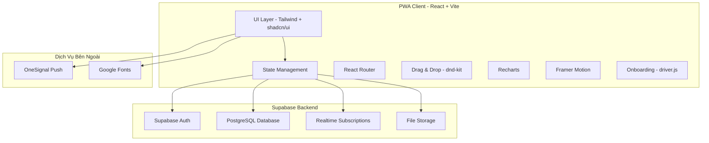
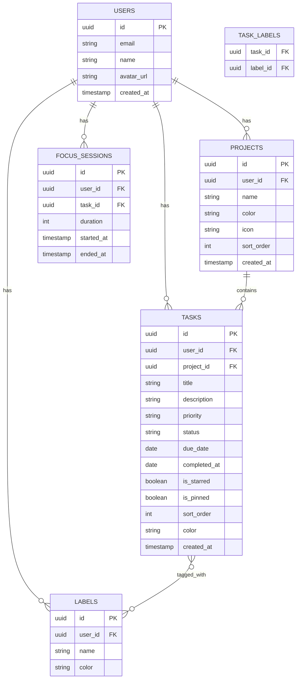

# 🔍 Phân Tích Website TaskFlow.pro.vn

## 📊 Tổng Quan

**URL:** https://www.taskflow.pro.vn  
**Mô tả:** "TaskFlow - Focus, manage tasks, and stay calm"  
**Loại:** Progressive Web App (PWA) - Ứng dụng quản lý tác vụ cá nhân  

---

## 🛠️ Tech Stack (Phát hiện từ source)

| Layer | Công nghệ | Bằng chứng |
|-------|-----------|------------|
| **Framework** | React + Vite | SPA với `
`, bundle `/assets/index-*.js` |
| **Styling** | Tailwind CSS + shadcn/ui | CSS variables `hsl(var(--*))`, component classes |
| **Backend/DB** | Supabase | 85 occurrences trong JS bundle |
| **Auth** | Supabase Auth | signIn(72), signUp(8), signOut(12), onAuthStateChange(6) |
| **Charts** | Recharts | LineChart, BarChart, AreaChart, RadialBar |
| **Drag & Drop** | @dnd-kit | droppable(79), draggable(55), sortable(12) |
| **Onboarding** | driver.js | driver(69), highlight(7), popover(128) |
| **Animations** | Framer Motion | animate(59), transition(213), spring(5) |
| **Notifications** | OneSignal Push | OneSignal SDK v16, push(524) |
| **Storage** | Supabase Storage + localStorage | storage(214), bucket(77), localStorage(36) |
| **Realtime** | Supabase Realtime | realtime(30), subscribe(76), channel(160) |
| **PWA** | vite-plugin-pwa | manifest.json, service worker, offline support |

---

## 🎯 Các Tính Năng Cốt Lõi (Phát hiện từ JS bundle)

### 1. 📋 Quản Lý Tác Vụ (Task Management)
- **Tạo/Sửa/Xóa tác vụ** - task(308), delete(189)
- **Ưu tiên** - priority(55), status(262)
- **Deadline & Ngày** - deadline(10), today(60), tomorrow(3), week(190), month(241)
- **Nhãn & Thẻ** - label(258), tag(184), category(44)
- **Màu sắc & Icon** - color(219), icon(158), emoji(71)
- **Ghim & Đánh dấu sao** - pin(74), star(578)
- **Trạng thái** - completed(56), in-progress(11)
- **Tiến độ** - progress(55)

### 2. 📅 Chế Độ Xem (Views)
- **Danh sách** - list(443)
- **Bảng/Kanban** - board(50), column(28)
- **Lưới** - grid(88)
- **Lịch** - calendar(5)
- **Chuyển đổi view** - view(220)

### 3. ⏱️ Focus & Pomodoro Timer
- **Focus mode** - focus(436) ← Tính năng nổi bật nhất!
- **Pomodoro timer** - pomodoro(26), timer(150)
- **Hàng ngày** - daily(55)

### 4. 📊 Thống Kê & Phân Tích (Analytics)
- **Dashboard** - dashboard(28)
- **Biểu đồ** - chart(127), analytics(20)
- **Recharts**: LineChart, BarChart, AreaChart, RadialBar

### 5. 🔍 Tìm Kiếm & Lọc
- **Tìm kiếm** - search(113)
- **Lọc** - filter(248)
- **Sắp xếp** - sort(65)

### 6. 📤 Nhập/Xuất & Đồng Bộ
- **Export** - export(44)
- **Import** - import(14)
- **Đồng bộ realtime** - sync(606), realtime(30)

### 7. 🎨 Giao Diện & UX
- **Sidebar** - sidebar navigation
- **Dark mode** - dark-mode(5), theme(58)
- **Responsive** - responsive(2), mobile(12)
- **Onboarding tour** - driver.js
- **Toast notifications** - toast(270)
- **Context menu** - contextmenu(20)
- **Dialog/Modal** - dialog(77), modal(10)

### 8. 🔔 Thông Báo
- **Push notifications** - OneSignal
- **Nhắc nhở** - reminder(29), notification(59)

### 9. 🔄 Tác Vụ Định Kỳ
- **Lặp lại** - repeat(11), recurring
- **Hàng ngày/tuần/tháng** - daily(55), weekly(17), monthly(2)

### 10. 👤 Tài Khoản & Cài Đặt
- **Auth** - login, register, profile(75)
- **Cài đặt** - setting(87)
- **Avatar** - avatar(39)

### 11. 📱 PWA
- **Cài đặt trên thiết bị** - standalone display
- **Offline support** - offline(4)
- **Service worker** - registerSW.js

---

## 🏗️ Kiến Trúc Hệ Thống

---

## 📐 Data Model (Suy luận)

---

## 🎨 UI Components (shadcn/ui)

| Component | Sử dụng |
|-----------|---------|
| Dialog | Tạo/sửa task, cài đặt |
| Sheet | Sidebar mobile |
| Popover | DatePicker, ColorPicker |
| Tooltip | Hiển thị hint |
| Toast | Thông báo thành công/lỗi |
| Tabs | Chuyển đổi views |
| ContextMenu | Click chuột phải |
| Command | Command palette (Ctrl+K) |
| Badge | Nhãn, trạng thái |
| Progress | Thanh tiến độ |
| Avatar | Ảnh đại diện |
| Accordion | Nhóm collapsible |

---

## 📱 Responsive Breakpoints

- **Mobile:** < 768px - Bottom navigation, sheet sidebar
- **Tablet:** 768px - 1024px - Collapsible sidebar
- **Desktop:** > 1024px - Full sidebar, multi-column layout
