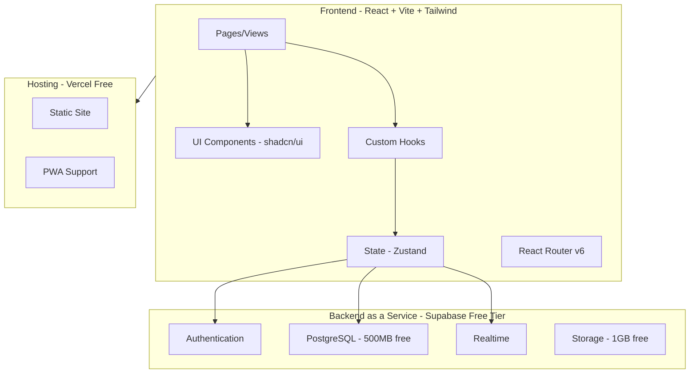
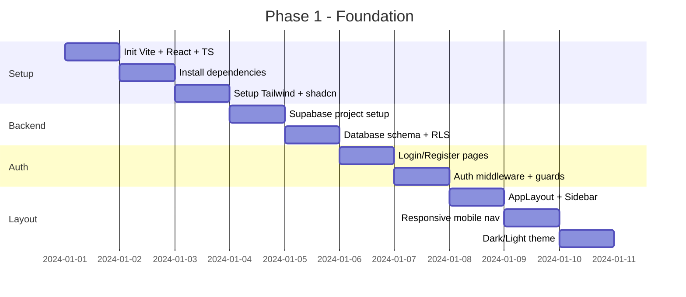

# 🚀 Kế Hoạch Phát Triển TaskFlow Clone

## 🎯 Mục Tiêu

Xây dựng ứng dụng quản lý tác vụ **TaskFlow Clone** với đầy đủ tính năng cốt lõi, chạy miễn phí trên Vercel/Netlify/GitHub Pages, sử dụng Supabase free tier làm backend.

---

## 🏗️ Kiến Trúc Hệ Thống



---

## 🛠️ Tech Stack & Lý Do Chọn

| Layer | Công Nghệ | Lý Do | Thay Thế Bị Loại |
|-------|-----------|-------|-------------------|
| **Build Tool** | Vite | Nhanh, HMR tốt, PWA plugin | CRA (chậm), Webpack (phức tạp) |
| **Framework** | React 18 | Ecosystem lớn, dễ tìm tài liệu | Vue (ít component library), Svelte (nhỏ ecosystem) |
| **Styling** | Tailwind CSS + shadcn/ui | Copy-paste components, tùy biến cao | MUI (nặng), Chakra (ít linh hoạt) |
| **State** | Zustand | Nhẹ, đơn giản, không boilerplate | Redux (phức tạp), Jotai (ít features) |
| **Routing** | React Router v6 | Standard, nested routes | TanStack Router (mới, ít tài liệu) |
| **Backend** | Supabase | Free tier generous, Auth + DB + Realtime | Firebase (ít free hơn), Appwrite (ít mature) |
| **Drag & Drop** | @dnd-kit | Nhẹ, accessible, tốt nhất cho React | react-beautiful-dnd (deprecated), react-dnd (phức tạp) |
| **Charts** | Recharts | React-native, declarative | Chart.js (imperative), Victory (nặng) |
| **Animations** | Framer Motion | Declarative, powerful | react-spring (phức tạp hơn) |
| **Icons** | Lucide React | Consistent, tree-shakeable | react-icons (nặng), Heroicons (ít hơn) |
| **Hosting** | Vercel | Free, CI/CD tự động, edge functions | Netlify (tương tự), GH Pages (ít features) |

---

## 📦 Cấu Trúc Dự Án

```
taskflow-clone/
├── public/
│   ├── favicon.svg
│   ├── logo.png
│   └── manifest.json
├── src/
│   ├── components/
│   │   ├── ui/              # shadcn/ui components
│   │   │   ├── button.tsx
│   │   │   ├── dialog.tsx
│   │   │   ├── input.tsx
│   │   │   ├── toast.tsx
│   │   │   └── ...
│   │   ├── layout/
│   │   │   ├── AppLayout.tsx
│   │   │   ├── Sidebar.tsx
│   │   │   ├── Header.tsx
│   │   │   └── MobileNav.tsx
│   │   ├── tasks/
│   │   │   ├── TaskList.tsx
│   │   │   ├── TaskCard.tsx
│   │   │   ├── TaskForm.tsx
│   │   │   ├── TaskBoard.tsx
│   │   │   ├── TaskCalendar.tsx
│   │   │   └── TaskFilters.tsx
│   │   ├── focus/
│   │   │   ├── FocusTimer.tsx
│   │   │   ├── FocusMode.tsx
│   │   │   └── FocusStats.tsx
│   │   ├── dashboard/
│   │   │   ├── Dashboard.tsx
│   │   │   ├── StatsCards.tsx
│   │   │   └── Charts.tsx
│   │   ├── projects/
│   │   │   ├── ProjectList.tsx
│   │   │   └── ProjectForm.tsx
│   │   ├── labels/
│   │   │   ├── LabelManager.tsx
│   │   │   └── LabelBadge.tsx
│   │   ├── settings/
│   │   │   ├── SettingsPage.tsx
│   │   │   ├── ThemeToggle.tsx
│   │   │   └── ProfileForm.tsx
│   │   └── shared/
│   │       ├── SearchCommand.tsx
│   │       ├── DatePicker.tsx
│   │       ├── ColorPicker.tsx
│   │       └── EmptyState.tsx
│   ├── hooks/
│   │   ├── useTasks.ts
│   │   ├── useProjects.ts
│   │   ├── useLabels.ts
│   │   ├── useFocus.ts
│   │   ├── useAuth.ts
│   │   └── useTheme.ts
│   ├── store/
│   │   ├── taskStore.ts
│   │   ├── projectStore.ts
│   │   ├── uiStore.ts
│   │   └── authStore.ts
│   ├── lib/
│   │   ├── supabase.ts
│   │   ├── utils.ts
│   │   └── constants.ts
│   ├── types/
│   │   └── index.ts
│   ├── pages/
│   │   ├── HomePage.tsx
│   │   ├── TodayPage.tsx
│   │   ├── WeekPage.tsx
│   │   ├── ProjectPage.tsx
│   │   ├── FocusPage.tsx
│   │   ├── DashboardPage.tsx
│   │   ├── SettingsPage.tsx
│   │   ├── LoginPage.tsx
│   │   └── RegisterPage.tsx
│   ├── App.tsx
│   ├── main.tsx
│   └── index.css
├── supabase/
│   └── migrations/
│       └── 001_initial_schema.sql
├── .env.example
├── index.html
├── package.json
├── tailwind.config.ts
├── tsconfig.json
├── vite.config.ts
└── components.json          # shadcn/ui config
```

---

## 📊 Implementation Phases

### Phase 1: Foundation (Tuần 1)
> Thiết lập project, auth, layout cơ bản



**Tasks:**
1. `npm create vite@latest taskflow-clone -- --template react-ts`
2. Cài đặt: tailwindcss, shadcn-ui, zustand, react-router-dom, @supabase/supabase-js, @dnd-kit/core, recharts, framer-motion, lucide-react, driver.js
3. Setup Supabase project tại [supabase.com](https://supabase.com)
4. Tạo database schema (xem phần Database Schema bên dưới)
5. Implement Auth flow với Supabase
6. Tạo AppLayout với Sidebar responsive

### Phase 2: Core Task Management (Tuần 2)
> CRUD tasks, projects, labels, views

**Tasks:**
1. Task CRUD (Create, Read, Update, Delete)
2. Project CRUD
3. Label/Tag management
4. Task filtering & sorting
5. Task search (Ctrl+K command palette)
6. Multiple views: List, Board (Kanban), Grid
7. Drag & drop reorder tasks
8. Star/Pin tasks

### Phase 3: Focus & Timer (Tuần 3)
> Pomodoro timer, focus mode, analytics

**Tasks:**
1. Pomodoro timer component
2. Focus mode (full screen, minimal UI)
3. Focus session tracking
4. Dashboard with charts
5. Task completion statistics
6. Focus history

### Phase 4: Polish & Deploy (Tuần 4)
> PWA, notifications, deploy

**Tasks:**
1. PWA setup (manifest, service worker)
2. Dark mode refinement
3. Onboarding tour (driver.js)
4. Export/Import data
5. Deploy to Vercel
6. Custom domain setup (optional)

---

## 🗄️ Database Schema (Supabase/PostgreSQL)

```sql
-- Enable UUID extension
CREATE EXTENSION IF NOT EXISTS "uuid-ossp";

-- Users table (managed by Supabase Auth)
-- auth.users already exists in Supabase

-- Projects
CREATE TABLE projects (
    id UUID DEFAULT uuid_generate_v4() PRIMARY KEY,
    user_id UUID REFERENCES auth.users(id) ON DELETE CASCADE NOT NULL,
    name TEXT NOT NULL,
    color TEXT DEFAULT '#6366f1',
    icon TEXT DEFAULT '📁',
    sort_order INTEGER DEFAULT 0,
    created_at TIMESTAMPTZ DEFAULT NOW(),
    updated_at TIMESTAMPTZ DEFAULT NOW()
);

-- Labels
CREATE TABLE labels (
    id UUID DEFAULT uuid_generate_v4() PRIMARY KEY,
    user_id UUID REFERENCES auth.users(id) ON DELETE CASCADE NOT NULL,
    name TEXT NOT NULL,
    color TEXT DEFAULT '#6366f1',
    created_at TIMESTAMPTZ DEFAULT NOW()
);

-- Tasks
CREATE TABLE tasks (
    id UUID DEFAULT uuid_generate_v4() PRIMARY KEY,
    user_id UUID REFERENCES auth.users(id) ON DELETE CASCADE NOT NULL,
    project_id UUID REFERENCES projects(id) ON DELETE SET NULL,
    title TEXT NOT NULL,
    description TEXT DEFAULT '',
    priority TEXT DEFAULT 'medium' CHECK (priority IN ('low', 'medium', 'high', 'urgent')),
    status TEXT DEFAULT 'todo' CHECK (status IN ('todo', 'in_progress', 'completed')),
    due_date DATE,
    completed_at TIMESTAMPTZ,
    is_starred BOOLEAN DEFAULT FALSE,
    is_pinned BOOLEAN DEFAULT FALSE,
    color TEXT,
    sort_order INTEGER DEFAULT 0,
    parent_id UUID REFERENCES tasks(id) ON DELETE CASCADE,
    created_at TIMESTAMPTZ DEFAULT NOW(),
    updated_at TIMESTAMPTZ DEFAULT NOW()
);

-- Task-Label junction table
CREATE TABLE task_labels (
    task_id UUID REFERENCES tasks(id) ON DELETE CASCADE,
    label_id UUID REFERENCES labels(id) ON DELETE CASCADE,
    PRIMARY KEY (task_id, label_id)
);

-- Focus sessions
CREATE TABLE focus_sessions (
    id UUID DEFAULT uuid_generate_v4() PRIMARY KEY,
    user_id UUID REFERENCES auth.users(id) ON DELETE CASCADE NOT NULL,
    task_id UUID REFERENCES tasks(id) ON DELETE SET NULL,
    duration INTEGER NOT NULL, -- seconds
    started_at TIMESTAMPTZ DEFAULT NOW(),
    ended_at TIMESTAMPTZ
);

-- User settings
CREATE TABLE user_settings (
    user_id UUID REFERENCES auth.users(id) ON DELETE CASCADE PRIMARY KEY,
    theme TEXT DEFAULT 'system' CHECK (theme IN ('light', 'dark', 'system')),
    focus_duration INTEGER DEFAULT 25, -- minutes
    break_duration INTEGER DEFAULT 5,
    long_break_duration INTEGER DEFAULT 15,
    auto_start_breaks BOOLEAN DEFAULT FALSE,
    notifications_enabled BOOLEAN DEFAULT TRUE,
    updated_at TIMESTAMPTZ DEFAULT NOW()
);

-- Row Level Security (RLS)
ALTER TABLE projects ENABLE ROW LEVEL SECURITY;
ALTER TABLE tasks ENABLE ROW LEVEL SECURITY;
ALTER TABLE labels ENABLE ROW LEVEL SECURITY;
ALTER TABLE task_labels ENABLE ROW LEVEL SECURITY;
ALTER TABLE focus_sessions ENABLE ROW LEVEL SECURITY;
ALTER TABLE user_settings ENABLE ROW LEVEL SECURITY;

-- RLS Policies: Users can only access their own data
CREATE POLICY "Users can manage own projects" ON projects
    FOR ALL USING (auth.uid() = user_id);

CREATE POLICY "Users can manage own tasks" ON tasks
    FOR ALL USING (auth.uid() = user_id);

CREATE POLICY "Users can manage own labels" ON labels
    FOR ALL USING (auth.uid() = user_id);

CREATE POLICY "Users can manage own task_labels" ON task_labels
    FOR ALL USING (
        EXISTS (SELECT 1 FROM tasks WHERE tasks.id = task_labels.task_id AND tasks.user_id = auth.uid())
    );

CREATE POLICY "Users can manage own focus_sessions" ON focus_sessions
    FOR ALL USING (auth.uid() = user_id);

CREATE POLICY "Users can manage own settings" ON user_settings
    FOR ALL USING (auth.uid() = user_id);

-- Indexes for performance
CREATE INDEX idx_tasks_user_id ON tasks(user_id);
CREATE INDEX idx_tasks_project_id ON tasks(project_id);
CREATE INDEX idx_tasks_due_date ON tasks(due_date);
CREATE INDEX idx_tasks_status ON tasks(status);
CREATE INDEX idx_tasks_priority ON tasks(priority);
CREATE INDEX idx_projects_user_id ON projects(user_id);
CREATE INDEX idx_focus_sessions_user_id ON focus_sessions(user_id);
```

---

## 🔐 Security Considerations

| Rủi ro | Mức độ | Mitigation |
|--------|--------|------------|
| SQL Injection | 🟢 Thấp | Supabase dùng parameterized queries |
| XSS | 🟡 Trung bình | React auto-escape, CSP headers |
| CSRF | 🟢 Thấp | Supabase auth dùng JWT, không cookie |
| Data leak | 🟡 Trung bình | RLS policies bắt buộc trên mọi table |
| Auth bypass | 🟡 Trung bình | Supabase Auth + email verification |
| Exposed API keys | 🟡 Trung bình | Supabase anon key an toàn với RLS |

---

## 💰 Chi Phí (Hoàn Toàn Miễn Phí)

| Dịch Vụ | Free Tier | Giới Hạn |
|---------|-----------|----------|
| **Vercel** | Free | 100GB bandwidth/tháng |
| **Supabase** | Free | 500MB DB, 1GB storage, 50K MAU |
| **GitHub** | Free | Unlimited public repos |
| **Google Fonts** | Free | Unlimited |
| **OneSignal** | Free | 10K subscribers (optional) |

> ✅ **Tổng chi phí: $0** cho đến khi vượt giới hạn free tier.

---

## 📋 Triển Khai Từng Bước

### Bước 1: Tạo Supabase Project
1. Đăng ký tại [supabase.com](https://supabase.com)
2. Tạo project mới
3. Copy `Project URL` và `anon key`
4. Chạy SQL migration trong SQL Editor

### Bước 2: Setup Local Development
```bash
# Clone và setup
npm create vite@latest taskflow-clone -- --template react-ts
cd taskflow-clone

# Cài dependencies
npm install @supabase/supabase-js zustand react-router-dom
npm install @dnd-kit/core @dnd-kit/sortable @dnd-kit/utilities
npm install recharts framer-motion lucide-react driver.js
npm install -D tailwindcss @tailwindcss/vite

# Setup shadcn/ui
npx shadcn@latest init
npx shadcn@latest add button dialog input toast tooltip
npx shadcn@latest add tabs select separator dropdown-menu
npx shadcn@latest add context-menu popover sheet command
npx shadcn@latest add progress badge avatar scroll-area
npx shadcn@latest add calendar checkbox textarea switch
```

### Bước 3: Environment Variables
```env
VITE_SUPABASE_URL=https://your-project.supabase.co
VITE_SUPABASE_ANON_KEY=your-anon-key
```

### Bước 4: Deploy
```bash
# Push to GitHub
git init && git add . && git commit -m "init"
git remote add origin https://github.com/you/taskflow-clone.git
git push -u origin main

# Deploy on Vercel
# 1. Go to vercel.com
# 2. Import GitHub repo
# 3. Add environment variables
# 4. Deploy
```

---

## 🎯 Scope Cho MVP

### ✅ Bao gồm (MVP)
- [ ] Auth (Login/Register/Logout)
- [ ] Task CRUD với priority, status, due date
- [ ] Project CRUD
- [ ] Label management
- [ ] 3 views: List, Board (Kanban), Grid
- [ ] Drag & drop reorder
- [ ] Search (Ctrl+K)
- [ ] Filter & Sort
- [ ] Focus/Pomodoro Timer
- [ ] Dashboard với charts
- [ ] Dark/Light theme
- [ ] Responsive (Mobile + Desktop)
- [ ] PWA support
- [ ] Star/Pin tasks

### ❌ Không bao gồm (MVP)
- Realtime collaboration
- File attachments
- Push notifications (OneSignal)
- Onboarding tour
- Export/Import
- Subtasks
- Recurring tasks
- Comments/Activity log

> 💡 Các tính năng "không bao gồm" có thể thêm vào phase sau khi MVP hoàn thành.

---

## ⚠️ Quyết Định Kiến Trúc

| Quyết định | Lựa Chọn | Lý Do | Thay Thế Bị Loại |
|-----------|----------|-------|-------------------|
| State Management | Zustand | Đơn giản, ít boilerplate, TypeScript tốt | Redux Toolkit (phức tạp hơn), Context API (performance issues) |
| CSS Approach | Tailwind + shadcn/ui | Copy-paste, tùy biến cao, consistent | CSS Modules (ít component), styled-components (runtime) |
| Backend | Supabase | All-in-one free tier, Postgres mạnh | Firebase (vendor lock-in), Appwrite (ít mature) |
| Hosting | Vercel | Zero-config deploy, edge network | Netlify (tương tự nhưng chậm hơn), GH Pages (ít features) |
| Drag & Drop | @dnd-kit | Accessible, flexible, maintained | react-beautiful-dnd (deprecated), react-dnd (complex) |
| TypeScript | Có | Type safety, better DX, fewer bugs | JavaScript (ít an toàn) |
